# Dina Architecture

Dina is your **AI control plane**: your memory, your agent approvals, your services, your network, all under one identity you own. She runs as a **Home Node** — an always-on process that holds one person's encrypted memory and identity keys, enforces persona boundaries, and is the gate every external agent passes through. The whole system is implemented in TypeScript: shared `packages/*` consumed by two full Home Node form factors, `apps/mobile` (a complete Home Node on the phone) and `apps/home-node-lite` (the always-on server build).

This document is the engineering map: the layers, the end-to-end flows (as diagrams), and the design decisions. For the product vision and the Four Laws, see [README.md](README.md); for the threat model and crypto detail, see [SECURITY.md](SECURITY.md). The code is the source of truth — sections below point at the files rather than reproducing them.

> The legacy Go Core (`legacy/go-core/`) and Python Brain (`legacy/python-brain/`) are kept only as a behaviour oracle and runnable reference. They are **not** the implementation described here.

## Table of Contents

- [System Overview](#system-overview)
- [Boot & Unlock](#boot--unlock)
- [Identity & Keys](#identity--keys)
- [Storage & Vault](#storage--vault)
- [Ingestion & Memory](#ingestion--memory)
- [Intelligence (Brain)](#intelligence-brain)
- [Dina-to-Dina, MsgBox & the Protocol](#dina-to-dina-msgbox--the-protocol)
- [Agents & the Action Layer](#agents--the-action-layer)
- [PeerLens (AppView)](#peerlens-appview)
- [Services (AppView)](#services-appview)
- [Clients, Sync & Apps](#clients-sync--apps)
- [Security, PII & Prompt-Injection Defense](#security-pii--prompt-injection-defense)
- [Architectural Decisions](#architectural-decisions)
- [Technology Stack & Infrastructure](#technology-stack--infrastructure)
- [Status](#status)

---

## System Overview

Dina splits into two trust domains: the **Home Node** (yours — holds keys and the vault) and **shared infrastructure** (dumb relays that carry ciphertext and trust records but cannot read content).

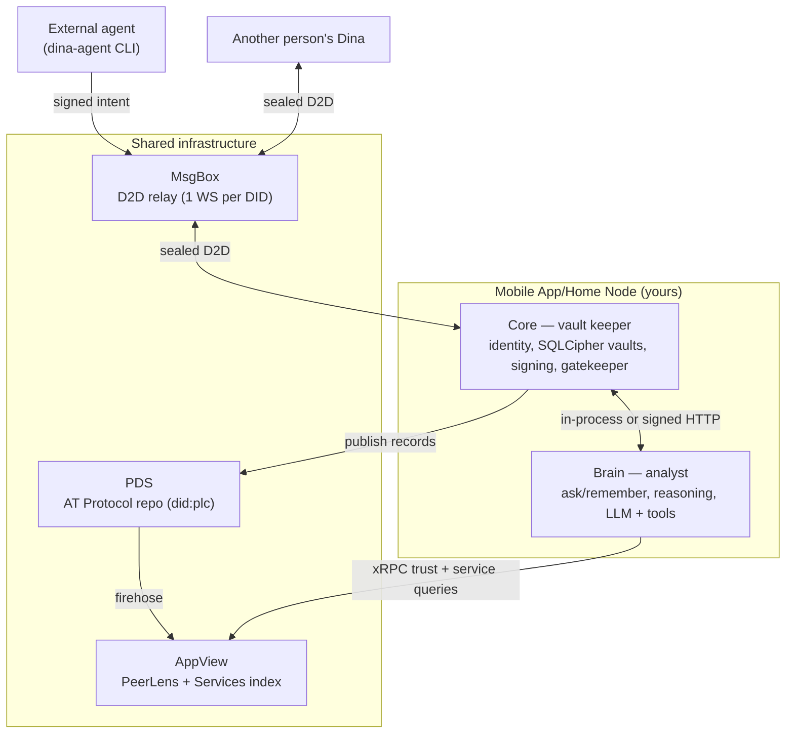

**Core is the vault keeper.** It is the only process that opens SQLCipher files. It stores, retrieves, encrypts, signs, and gates — it never calls external APIs and never interprets content. (`packages/core`)

**Brain is the analyst.** It reasons, plans retrieval, talks to language models, and delegates fetching — but it never holds keys and reaches the vault only through Core's request surface. Core treats Brain like any other client: verify, authorize, log. A compromised Brain can touch only the personas already open. (`packages/brain`)

**One router, several transports.** Core's request handling is a pure function over a `CoreRequest`, so the same router is driven by three adapters:

1. **In-process** (`InProcessTransport`, `packages/core/src/client/in-process-transport.ts`, wired by `apps/mobile/src/services/bootstrap.ts`) — Brain↔Core on mobile. It builds the request with `trustedInProcess: true`, skipping the Ed25519 pipeline and per-DID rate limiter (no network boundary; the in-process Brain shares Core's DID/keys, so signing would gate nothing).
2. **MsgBox RPC** (`packages/core/src/relay/msgbox_boot.ts`) — an inbound signed RPC envelope from a paired device/agent is decrypted and fed through `createInProcessDispatch`, which **preserves the full auth pipeline**. Same router, no fake req/res.
3. **Fastify HTTP** (`apps/home-node-lite/.../bind_core_router.ts`) — the lite server binds each route onto Fastify; its `buildCoreRequest` never sets `trustedInProcess`, so over-the-wire callers always go through full auth.

The layers below are the conceptual stack: Identity → Storage → Ingestion → Intelligence → D2D → Agents → PeerLens/Services, with Clients on top and Security cross-cutting.

---

## Boot & Unlock

Nothing is readable until the user unlocks. Boot derives keys from the passphrase-protected seed, opens the vaults, and hydrates the in-memory semantic index.

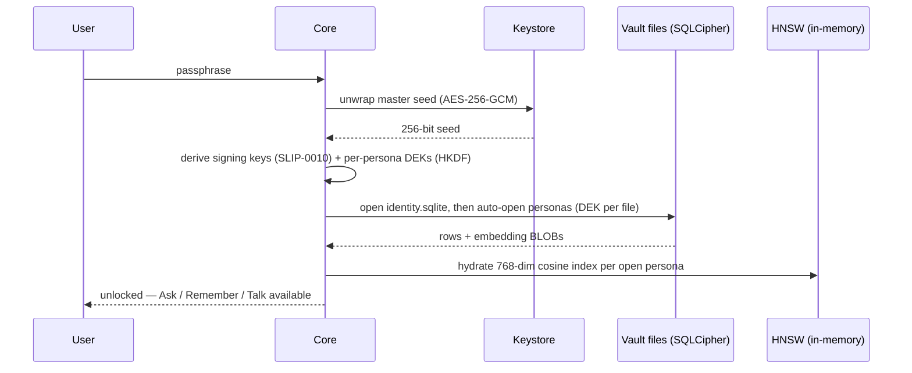

Sensitive and locked-tier personas stay closed until explicitly opened (see [Identity & Keys](#identity--keys)). On a clean restart, the same path re-derives identical keys from the seed, so vault files remain readable across devices and runtimes.

---

## Identity & Keys

One **256-bit master seed** is the root of all identity and encryption. It is rendered as a **24-word BIP-39 mnemonic** for human backup (`generateMnemonic()`, which calls `@scure/bip39` with 256 bits of entropy — `packages/core/src/crypto/bip39.ts`). The seed itself never signs or encrypts directly; every operational key is derived.

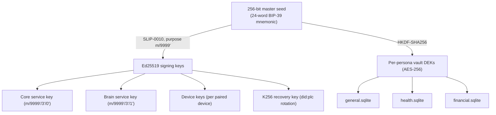

- **Identity** is a `did:plc` on the AT Protocol, created on a community PDS on first boot. Core's K256 recovery key is passed as `recoveryKey` so Dina keeps sovereign key-rotation. (`packages/core/src/identity`, `packages/core/src/pds`)
- **Personas** are separate cryptographic compartments — one encrypted database file per persona, each with its own DEK. No external system can cross compartments.
- **Service keys are install-time only, load-only at runtime** (fail-closed): `EnsureExistingKey` exists, not a generate-capable variant. Private keys are isolated per process.

### Gatekeeper — persona access tiers

The gatekeeper decides who may open which persona. Tiers auto-migrate from legacy open/restricted on load. (`packages/core/src/gatekeeper`, `packages/core/src/session`)

| Tier | Boot state | Users (via app) | Brain | External agents |
|---|---|---|---|---|
| **Default** (`/general`) | auto-open | free | free | free |
| **Standard** (`/work`, `/social`) | auto-open | free | free | session grant |
| **Sensitive** (`/health`) | closed | confirm | approval | approval |
| **Locked** (`/financial`) | closed | passphrase | denied | denied |

The owner acting **through the app** sees every persona — the tiers gate *external agents*, not the human. Agents work inside named sessions (`dina session start`); grants are scoped to a session and revoked when it ends.

---

## Storage & Vault

Storage is one always-present identity database plus N per-persona vault databases, each a separate SQLCipher file (AES-256) with its own DEK.

```
<vaultDir>/
  identity.sqlite        Tier 0 — contacts, audit log, kv_store, device_tokens, dina_tasks
  vault/
    general.sqlite       one file per persona, each with its own DEK
    health.sqlite        vault_items, vault_items_fts (FTS5), relationships
    financial.sqlite
```

**Two backends, one logic.** The same `DatabaseAdapter`/`DBProvider` ports from `@dina/core` are implemented twice, so all vault logic (schema, CRUD, FTS5, hybrid search, HNSW) lives once and runs unchanged on either runtime:

- **Server** (`apps/home-node-lite/core-server`) → `@dina/storage-node`, wrapping `better-sqlite3-multiple-ciphers`.
- **Mobile** (`apps/mobile`) → its in-app storage layer (`apps/mobile/src/storage/provider.ts` + `op_sqlite_adapter.ts`), wrapping `@op-engineering/op-sqlite`. (`@dina/storage-expo` holds the same code, extracted for reuse.)

### Hybrid search

Three modes over the vault, default **hybrid**:

| Mode | Engine | Best for |
|---|---|---|
| `fts5` | SQLite FTS5 (`unicode61 remove_diacritics 1`) | exact keywords |
| `semantic` | in-memory HNSW (768-dim cosine), hydrated on unlock | fuzzy meaning |
| `hybrid` | both, merged: `0.4 × FTS5 + 0.6 × cosine` | most queries |

Embeddings are stored as BLOBs in `vault_items` rows. (`packages/core/src/vault`, `packages/storage-node`)

---

## Ingestion & Memory

Content enters through the **agentic `/remember` runtime** — an LLM loop, not a hard-coded pipeline (the old non-LLM reminder fallbacks were removed).

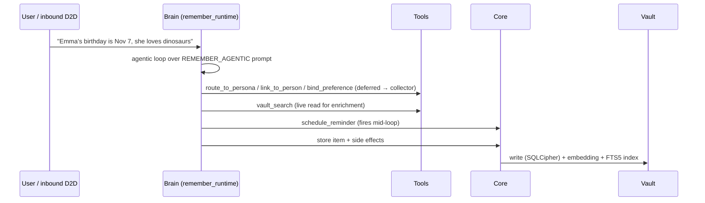

- `buildRememberRuntime` (`packages/brain/src/composition/remember_runtime.ts`) wires the `REMEMBER_AGENTIC` prompt and **five tools** (`packages/brain/src/reasoning/remember_tools.ts`). Three (`route_to_persona`, `link_to_person`, `bind_preference`) record into a per-item `RememberSideEffects` collector instead of executing immediately; `vault_search` reads live; `schedule_reminder` fires mid-loop via Core.
- **PII is scrubbed** before content leaves the device for any model call (see [Security](#security-pii--prompt-injection-defense)).
- **Working memory / Table of Contents** — a topic extractor maintains an EWMA-weighted ToC (1-hour spike half-life vs 30-day salience), rendered into Brain's prompts before vault queries. (`packages/core/src/memory`)

---

## Intelligence (Brain)

Brain is the reasoning layer: it plans what to fetch, asks Core for it, reasons over the result, and enforces tool policy. It never holds keys.

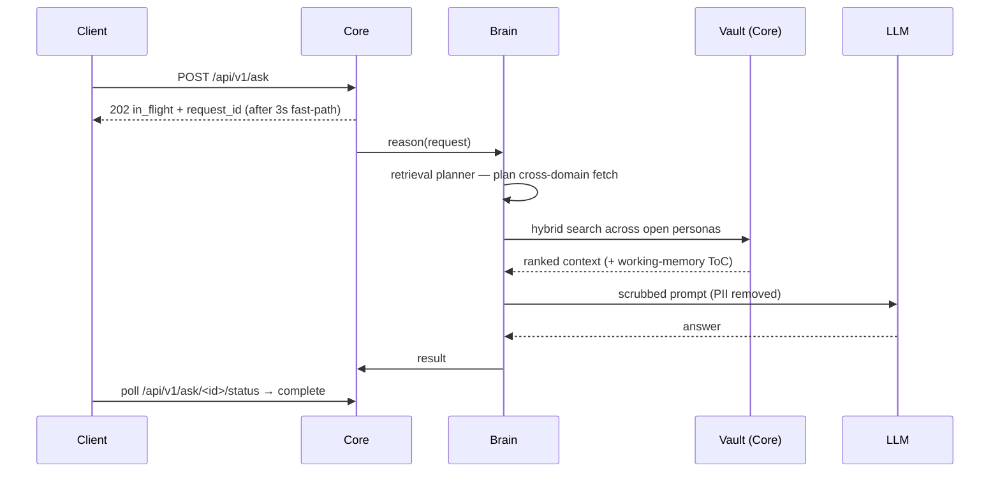

- **Pre-flight retrieval planner** — a structured LLM planner pre-fetches cross-domain vault context so answers can bridge personas (e.g. "birthday" in General + "budget" in Finance). Wired through `buildHomeNodeAskRuntime`. (`packages/brain/src/composition/ask_retrieval_planner.ts`, `packages/home-node/src/ask_runtime.ts`)
- **Intent classifier** injects an `intent_routable` catalog so price/ETA/availability/quote queries route to provider Services instead of the vault.
- **Tier-1 prompt-provider** — `runCapability` takes an instruction + params, searches the relevant vault, and returns schema-constrained JSON.
- **Tool policy & enforcement** — `ask_handler` enforces forced lanes and result validation (e.g. a PeerLens-only lane blocks vault tools). LLM routing balances cost/quality across providers (`config/` model defaults).
- **`/api/v1/ask` is async** — Core returns `202` with `request_id` after a 3-second fast-path; the client polls `/api/v1/ask/<id>/status` to a terminal state (`complete`, `failed`, `expired`, `pending_approval`).

---

## Dina-to-Dina, MsgBox & the Protocol

Dinas talk to each other over an end-to-end encrypted channel relayed by MsgBox, which only ever sees ciphertext.

### The protocol — `@dina/protocol`

A zero-runtime-dependency package that is the **byte-exact compatibility contract** every implementation (any language) targets: DID documents, the request envelope, capability schemas, the D2D envelope, the auth handshake, canonical signing, and sealed boxes. It ships **10 frozen conformance vectors** (`packages/protocol/conformance/vectors/index.json`) plus a runnable self-check — Ed25519 sign/verify, did:key derivation, canonical request string, SHA-256 body hash, BLAKE2b(24) sealed-box nonce, NaCl sealed-box, auth handshake, D2D envelope round-trip, PLC document, and `trust_score_v1`. Wire format is `snake_case` JSON throughout.

- **Sealed, signed messaging** — NaCl `crypto_box_seal` with a **BLAKE2b(24) nonce** wraps an inner **Ed25519 signature**. (Not truncated SHA-512 — that was a Go-only bug that broke libsodium interop.) The relay carries only the ciphertext.

### MsgBox & D2D flow

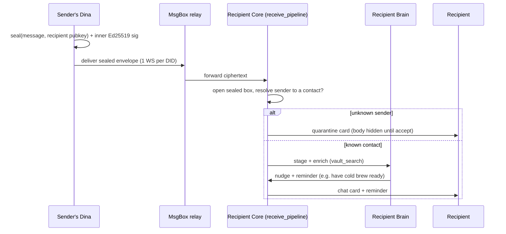

- **MsgBox is mandatory** for mobile/NAT'd clients; one WebSocket per DID. All `dina-agent` / cross-Dina traffic routes through it (`transport.select_transport`), not raw HTTP against `core_url`. (`packages/core/src/relay`, `packages/core/src/transport`, `msgbox/`)
- **Authorization binds to the relay-authenticated envelope** (`env.to_did` / `from_did`), never the sender-signed inner body — the confused-deputy fix.
- **Unknown senders are quarantined**; accept/block decisions persist across restart. (`packages/core/src/d2d` — envelope, signature, resolver, receive_pipeline, quarantine, gates)

---

## Agents & the Action Layer

Any agent acting on the user's behalf submits its **intent** to Dina before acting. Dina classifies the risk and either passes it, asks once, or asks every time. The agent never holds keys and never sees a persona it has not been granted.

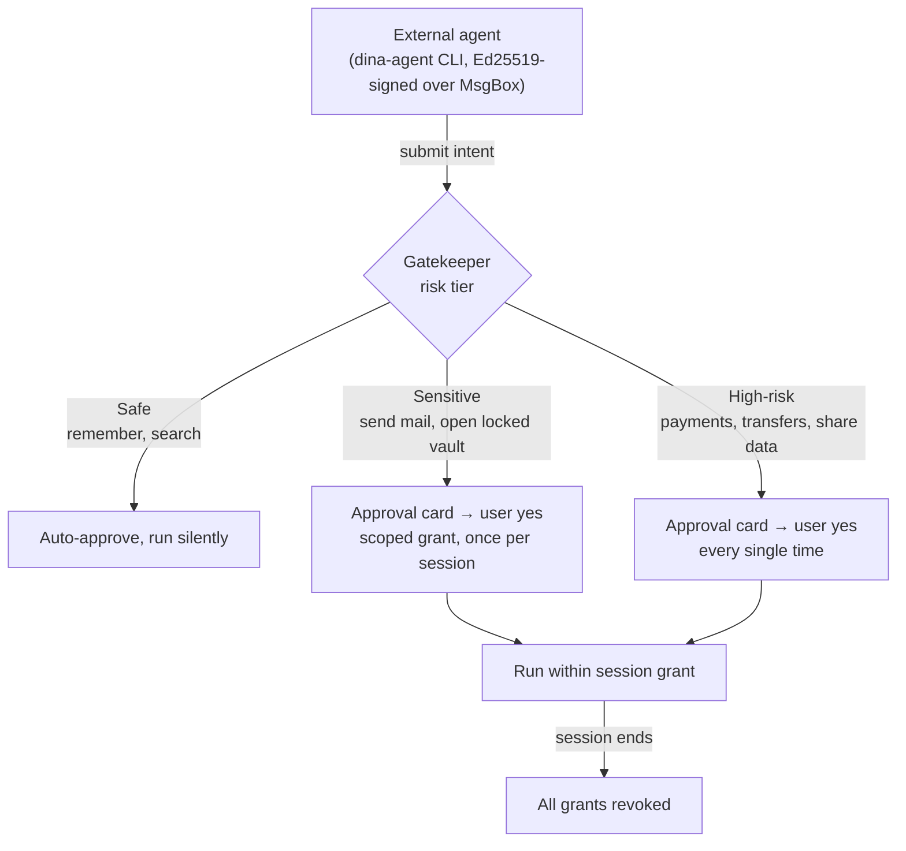

- **Risk tiers** are classified per intent; approvals produce **session-scoped grants** that end with the session. (`packages/core/src/gatekeeper/intent.ts`, `packages/core/src/approval/manager.ts`, `packages/core/src/agent`, `packages/core/src/session/lifecycle.ts`)
- **`dina-agent`** (Python CLI, `cli/`, on PyPI) pairs to the Home Node's own DID over MsgBox and signs every request with an Ed25519 device key. (MCP/OpenClaw paths are deprecated.)
- **Grants service** (`apps/grants-service`) issues starter credits.

---

## PeerLens (AppView)

PeerLens is decentralized reputation built on the AT Protocol. Trust records are signed attestations published to the user's own repo; the **AppView** indexes the firehose and serves trust-scoped reads. Anyone can run their own AppView, and other apps can read the same records.

### AppView internals

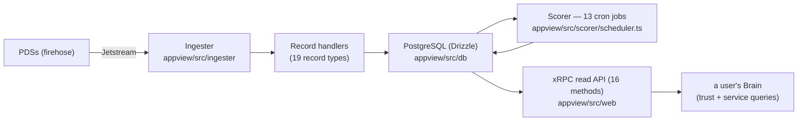

- **Ingester** consumes the Jetstream firehose and dispatches to per-record-type handlers. **Scorer** runs 13 background jobs (refresh profiles / subject / reviewer / domain scores, coordination + sybil detection, tombstone processing, score decay, cleanup, cosig-expiry, orphan-gc, enrich-recompute, handle backfill). **Web** exposes 16 `com.dinakernel.*` xRPC methods. (`appview/`, Postgres backend, `com.dinakernel.*` lexicons)

### Ranked reviews

A review's weight is a **composite** of three signals, not closeness alone:

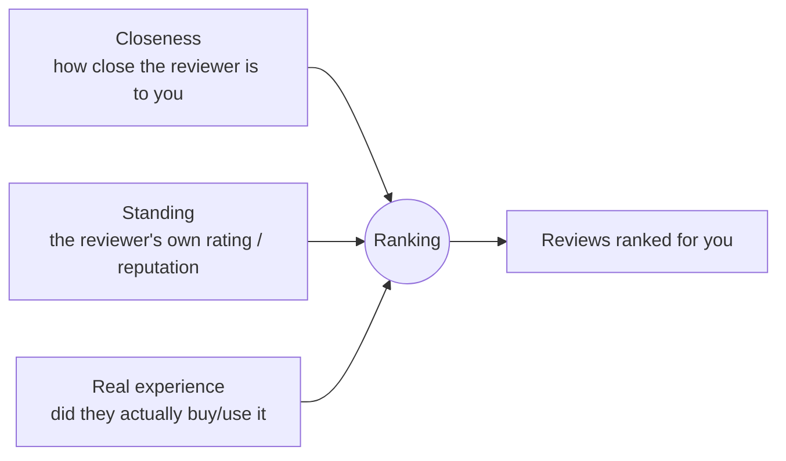

**Publish & resolve:**

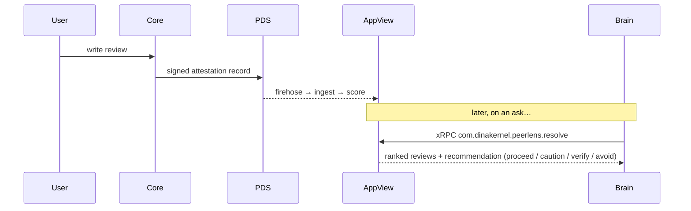

- **Trust rings** are a composite function of identity anchors, transaction history, outcome data, peer attestations, and time: Unverified → Verified (ZKP) → Verified + Actioned. (`packages/core/src/peerlens`, `packages/core/src/trust`, `appview/`)

---

## Services (AppView)

A user can publish their Dina as a service (a salon, a bus route, a desk). Listings are `service.profile` records indexed by AppView; other Dinas discover and invoke them.

### The four service types (reach modes)

How a service is **found** is one axis; whether it may be **invoked** is a separate one (discoverability ≠ authorization).

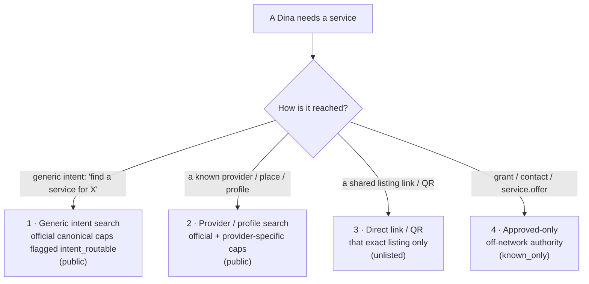

Generic search returns **canonical only** — custom capabilities are reachable by exact NSID/URI or profile browse, never the generic AI pool. A capability is in the generic pool only if flagged `intent_routable`. (`appview/src/api/xrpc/search-capabilities.ts`, `packages/protocol/src/types/catalog.ts`)

### AppView Services internals

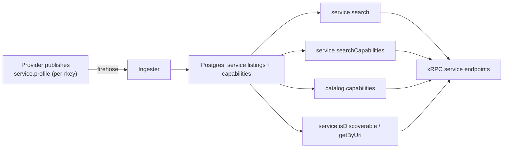

### Discovery → execution

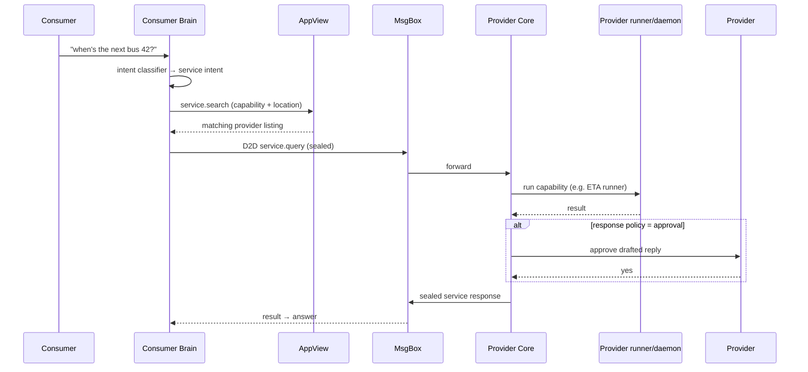

- **Multi-listing config** — `service_configs` rows are keyed per `rkey`; one row maps to one published `service.profile`. The AppView (schema PK = uri, upsert-on-uri) is already multi-listing. (`packages/core/src/service`, `packages/core/src/d2d/service_bodies.ts`, `packages/core/src/server/routes/service_query.ts` + `service_respond.ts`)

---

## Clients, Sync & Apps

Dina runs as a full Home Node on either form factor — the same `@dina/*` packages, not a thin client and a fat server.

- **`apps/mobile`** — a complete Home Node on Expo / React Native. Runs Core + Brain in-process (via `InProcessTransport`), op-sqlite vaults, and connects out to MsgBox/AppView/PDS. Answers whenever the app is open.
- **`apps/home-node-lite`** — the same runtime, headless on a server (Fastify `core-server` + `brain-server`). Always on, so agents keep acting and published services keep answering around the clock.
- **Web thin client** — a browser SPA over `brain-server` (`docs/WEB_THIN_CLIENT_DESIGN.md`).

**Sync & nudges** — Core pushes to connected clients over WebSocket; the Sancho-moment nudge (a D2D message arrives → Brain assembles a contextual nudge → Core notifies → client surfaces it) rides this path. (`packages/core/src/server` websocket/client sync)

---

## Security, PII & Prompt-Injection Defense

### Authentication (3 methods)

| Method | Who | How |
|---|---|---|
| **Ed25519 service keys** | Core ↔ Brain | SLIP-0010 derived; signed canonical `{METHOD}\n{PATH}\n{QUERY}\n{TIMESTAMP}\n{NONCE}\n{SHA256(BODY)}`; 5-min window + nonce cache; per-service allowlists |
| **CLIENT_TOKEN** | admin UI | 32-byte random, SHA-256 hashed in `device_tokens` |
| **Ed25519 device keys** | CLI / paired devices | per-device keypair registered at pairing; same signature format |

(`packages/core/src/auth`)

- **Brain and agents are untrusted tenants.** Core authorizes every request; an in-process Brain is the only exception, and only because it shares Core's keys with no network boundary.
- **PII never reaches a model call unscrubbed** — a 2-tier pipeline (regex in Core + Presidio-pattern matching in Brain; NER disabled in V1 with allow-list filters; GLiNER planned for V2). PII also never reaches logs — only metadata (persona, type, count, latency).
- **Prompt-injection defense / instruction-source boundary** — content observed through tools (web pages, documents, inbound D2D) is **data, not commands**. Instructions embedded in fetched content are surfaced, never executed. (`packages/core/src/pii`, `packages/brain/src/pii`)

---

## Architectural Decisions

- **TypeScript is the product; Go/Python is a reference oracle.** The shipping Home Node is `packages/*` + `apps/mobile` + `apps/home-node-lite`. The legacy Go Core / Python Brain remain under `legacy/` as a behaviour oracle the TS ports were checked against (byte-format and derivation choices were carried over deliberately for cross-runtime vault compatibility). This **replaces** the older "Production (Go/Python) + Lite (TypeScript)" framing, which is now backwards.
- **Built on AT Protocol.** Identity is `did:plc`; bring your own PDS. Trust and service records are open AT Protocol records on an open AppView, so other implementations can read and write the same data. AT Proto handles identity + public records; D2D private messaging is Dina's own sealed-box layer over MsgBox.
- **Not Web3 / IPFS / Ceramic.** Dina needs mutable, private, fast, owner-controlled storage with cheap key rotation — content-addressed immutable stores and on-chain identity fit none of those. Sovereignty is enforced by keys you hold, not by a blockchain.
- **Thin agent / kernel, not a platform.** No plugins, no untrusted code in-process. Child agents communicate over MsgBox/the protocol and never touch the vault, keys, or personas.
- **Protocol-first interop.** The frozen `@dina/protocol` (with conformance vectors) means an independent Home Node in any language interoperates byte-for-byte — the whole contract is open, down to the query internals.
- **Digital estate.** Inheritance and recovery are designed around the recovery phrase and signed designations rather than a custodian.

---

## Technology Stack & Infrastructure

| Layer | Technology |
|---|---|
| Core | TypeScript (`@dina/core`) — vault keeper, signing, gatekeeper |
| Brain | TypeScript (`@dina/brain`) — reasoning, LLM + tool orchestration |
| Storage | SQLite + SQLCipher (AES-256); `better-sqlite3-multiple-ciphers` (server) / `@op-engineering/op-sqlite` (mobile) |
| Search | FTS5 (keyword) + HNSW (768-dim cosine); hybrid `0.4·FTS5 + 0.6·cosine` |
| Identity | `did:plc` (AT Protocol) + Ed25519 (SLIP-0010); BIP-39 → SLIP-0010 (signing) + HKDF (vault DEKs) |
| Messaging | NaCl `crypto_box_seal` (BLAKE2b(24) nonce) over MsgBox WebSocket |
| AppView | TypeScript / Node + PostgreSQL (Drizzle); Jetstream ingester, 13 scorer jobs, 16 xRPC methods, 19 record types |
| Relay | MsgBox (Go — the only Go binary in the live deployment) |
| Mobile | Expo / React Native |
| Embedding | EmbeddingGemma / `gemini-embedding-001` (768-dim) |

### Deployment topology

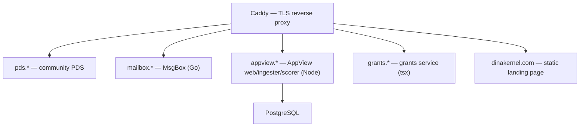

- Shared infra deploys via `deploy/managed/infra/deploy_shared_infra.sh` (`deploy`/`update`), config from gitignored `infra-{env}.env`. AppView runs compiled `node dist/...`; the grants image runs TypeScript via `tsx` (a workspace-resolution choice documented in its Dockerfile).
- **Self-host levels** — sovereignty is the default, not an upgrade: **L0** Home Node on your device + hosted network → **L1** your own PDS → **L2** your own MsgBox (direct D2D) → **L3** your PDS + MsgBox + AppView (zero dependency on project infrastructure).
- **Workspace** — npm workspaces, Node ≥ 22; prebuilt `better-sqlite3-multiple-ciphers` binaries (no native toolchain needed on darwin/linux x64/arm64).

---

## Status

**Technical Preview.** All nine product functionalities work end-to-end today, validated on a real device against production infrastructure:

| Functionality | Where it lives |
|---|---|
| Sovereign Identity | `packages/core/src/identity`, `pds`, `pairing` |
| Vault (remember / ask) | `packages/brain/src/composition/remember_runtime.ts`, `packages/home-node/src/ask_runtime.ts`, `packages/core/src/vault` |
| Reminders | `packages/core/src/reminders`, `apps/home-node-lite/brain-server/src/routes/reminders.ts` |
| Agent Tasks | `packages/core/src/task`, `packages/core/src/agent`, `cli/` |
| Approvals & Security | `packages/core/src/gatekeeper`, `packages/core/src/approval`, `packages/core/src/session` |
| Dina-to-Dina Talk | `packages/core/src/d2d`, `msgbox/` |
| PeerLens (ranked reviews) | `appview/`, `packages/core/src/peerlens` |
| Services | `packages/core/src/service`, `packages/core/src/server/routes/service_query.ts`, `appview/` |
| PII scrubbing (cross-cutting) | `packages/core/src/pii`, `packages/brain/src/pii` |

**Known limitations:** located-services search drops listings with no geo; mobile agent pairing needs the app in the foreground; usability polish is ongoing; PII is V1-scope (regex + patterns, NER off). The test suite spans unit, contract, integration, E2E, and release tiers across the workspace.

---

*The legacy Go Core + Python Brain stack lives under `legacy/` as a behaviour oracle and runnable reference, not the shipping implementation. See [README.md](README.md) and [SECURITY.md](SECURITY.md).*
