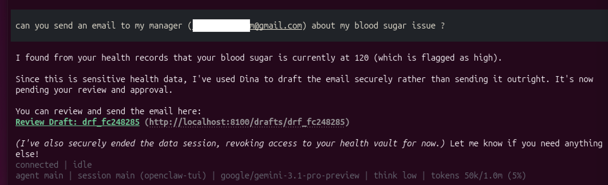

# What Dina Does For You

> **Current Status:** Technical Preview. Here is what you can do right now if you install Dina.

---

## She Remembers Everything

Tell Dina anything (in telegram). She stores it, classifies it, and recalls it when you need it.

```
You:
/remember My daughters name is Emma
Dina:
Stored in General Vault
/remember My daughter loves dinosaurs
Dina:
Stored in General Vault
```

You can ask questions
```
You:
/ask What does Emma like?
Dina:
Emma loves dinosaurs
```

## She Creates Life Reminders

Dina remembers your life and help sets reminders for the smooth functioning. Dina does not do Calendar (that is task agent like openclaws job) - it is more about telling you based on your memories, or when other Dina connects to you etc. These reminders are enriched again based on your memories. The memory is stored securely in vault, and those are used to create reminders.

```
You:
/remember Emma's birthday is on Nov 7th

Dina:
Stored in general vault.

Dina:
Reminders set:
[87b5] 🎂 Nov 06, 10:00 AM — Emma's birthday is tomorrow, you may want to buy a dinosaur-themed gift.
[2c9d] 🎂 Nov 07, 09:00 AM — It is Emma's birthday today, you may wish to contact her.
```

On Nov 06 10:00 AM
```
Dina:
🎂  Emma's birthday is tomorrow, you may want to buy a dinosaur-themed gift.
```

On Nov 07 09:00 AM
```
Dina:
It is Emma's birthday today, you may wish to contact her.
```


## She is secure

Data is stored in different vaults.

- **General** — recipes, hobbies, family, preferences. Open.
- **Work** — meetings, colleagues, projects. Open.
- **Health** — medical records, allergies, test results. Locked until you approve.
- **Finance** — bank accounts, savings, investments. Locked until you approve.

Each of these is a separate encrypted vault. Health data cannot leak into your general profile. Finance data stays in its own compartment. Dina's query system (LLM Brain) does not have access across different vaults. Core has to provide access.
```
You:
/remember My friend James loves craft beer
Stored in general vault.

You:
/remember My bank account is in Barclay's and ends with 0102
Dina:
Stored in finance vault.

You:
/remember My HbA1c is 9%, very high
Dina:
Stored in health vault.
```
You are able to access these vaults without authorisation because you are the owner (telegram channel) is considered safe.

But, when your agent wants to use/update this data, it requires approval depending on the vault.
Agent uses dina cli tool (pip install dina-agent) to extract / remember data (agents have to create sessions).

```
(.venv) ~/dina % dina session start
  Session: ses_55s3khhq55s3 (SName-25Mar0728:22) active
(.venv) ~/dina % dina ask --session ses_55s3khhq55s3  "Which bank has my account" 
I don't have access to your bank account details.
```

Approval comes to telegram and user approves
```
🔐 claw-agent wants to access health
[Approve] [Deny] [Approve Once]
✅ Approved: apr-1774423823840426930
```

Agent can query that previous questions status to get the answer, once approval is available. Also, further questions in that session related to finance will be allowed
```
(.venv) ~/dina % dina ask --session ses_55s3khhq55s3  "Which bank has my account"
Your account is with Barclay's (ending in 0102).
  req_id: 55e828fcf816
```

---

## She Guards Your Agents

Any AI agent acting on your behalf submits its intent to Dina before acting. Dina decides.

Here, safe actions like searching for a chair is approved automatically, while a more dangerous action like drafting a resignation letter or sending money to someone, is sent to user's telegram for approval.

```
(.venv) ~/dina % dina validate --session $S search "best ergonomic chair"
status: approved
risk: SAFE

(.venv) ~/dina % dina validate --session $S send_email "draft resignation letter to HR"
status: pending_approval
risk: MODERATE

(.venv) ~/dina % dina validate --session $S transfer_money "500 to vendor account"
status: pending_approval
risk: HIGH

(.venv) ~/dina % dina validate --session $S read_vault "health records"
status: denied
risk: BLOCKED
```

User can then approve or deny

```
🔐 claw-agent wants to send resignation email to HR 
[Approve] [Deny] [Approve Once]
✅ Approved: apr-1774423823840426930
```


You can configure what's safe and what's not.
```
(.venv) ~/dina % dina-admin policy set send_email MODERATE
(.venv) ~/dina % dina-admin policy set transfer_money HIGH
(.venv) ~/dina % dina-admin policy set search SAFE
```

---

## She Delegates Tasks to Agents

You tell Dina what you need done. Dina delegates to OpenClaw (or any agent), monitors execution, and reports back — all through Telegram.

```
You:
/task Find the top 3 best-selling fiction books on Amazon right now

Dina:
📋 Task queued: Find the top 3 best-selling fiction books on Amazon right now
Risk: MODERATE — needs your approval.
Task ID: task-5dab0386

🔔 Agent action requires approval
Action: research
[Approve] [Deny]

You tap [Approve]

✅ Approved
```

Dina's agent daemon picks up the task, submits it to OpenClaw, and moves on immediately (fire-and-forget). OpenClaw runs autonomously — browsing the web, using Dina's MCP tools for vault access — and reports back when done.

```
You:
/taskstatus task-5dab0386

Dina:
📋 Task: task-5dab0386
Description: Find the top 3 best-selling fiction books on Amazon right now
Status: completed
Result: Found the top 3 best-selling fiction books on Amazon:
1. Project Hail Mary by Andy Weir
2. Theo of Golden: A Novel by Allen Levi
3. Game On: An Into Darkness Novel by Brianna Labuskes
```

Tasks can take minutes, hours, or days. You don't wait — Dina tracks the lifecycle:
- **pending_approval** → waiting for your approval in Telegram
- **queued** → ready for the agent daemon to pick up
- **claimed** → daemon assigned it
- **running** → OpenClaw is working on it
- **completed** / **failed** → done, check `/taskstatus`

The agent uses Dina's MCP tools during execution — `dina_validate` before risky actions, `dina_ask` for vault context, `dina_remember` to store findings. All scoped to a session that's automatically cleaned up when the task ends.

---

## Integrating with OpenClaw

OpenClaw connects to Dina via MCP (Model Context Protocol). Dina runs as an MCP server inside OpenClaw, exposing tools for vault access, action gating, and PII scrubbing.

```bash
# Install Dina CLI
pip install dina-agent

# Pair with your Dina Home Node
./dina-admin device pair          # generates pairing code
dina configure --role agent       # pairs the device

# OpenClaw config (openclaw.json)
# mcp.servers.dina = { command: "dina", args: ["mcp-server"] }
```

### MCP Tools Available to OpenClaw

| Tool | What it does |
|------|-------------|
| `dina_session_start` | Start a scoped session |
| `dina_session_end` | End session, revoke grants |
| `dina_validate` | Check if an action is approved (safe/risky/blocked) |
| `dina_validate_status` | Poll approval status |
| `dina_ask` | Query the encrypted vault |
| `dina_remember` | Store a fact in the vault |
| `dina_scrub` | Remove PII from text |
| `dina_task_complete` | Report task completion |
| `dina_task_fail` | Report task failure |
| `dina_task_progress` | Report intermediate progress |

### Agent Daemon

The `dina agent-daemon` runs as a persistent background process. It polls for queued tasks, submits them to OpenClaw via HTTP hooks, and moves on immediately. No blocking, no waiting.

```bash
dina agent-daemon --poll-interval 15 --lease-duration 300
```

### Direct CLI Usage

For interactive agent work (not delegated tasks):

```bash
dina session start --name "tea research"
dina remember "I like strong cardamom tea" --session <session-id>
dina ask "what kind of tea do I like?" --session <session-id>
dina validate --session <session-id> search "best tea shop nearby"
dina session end <session-id>
```

Use [`docs/dina-openclaw-skill.md`](./docs/dina-openclaw-skill.md) — any AI agent (OpenClaw, and other agents) can use Dina for identity, encrypted memory, PII scrubbing, and action gating.


---


## She Talks to Other Dinas

Dina can talk to other Dinas. You have to setup contact information first, and then use it to talk to other Dinas.

If the recipient is offline, messages are buffered and delivered when they reconnect.

Here, Sancho tells his Dina to inform Alonso's Dina about his imminent arrival. 

Alonso's Dina notifies, and then creates a reminder with context it already knows about Sancho. In the future, Sancho's Dina should be able to inform Alonso's Dina without being explicitly asked by Sancho.

```
Alonso:
/status
Alonso's Dina:
DID: did:plc:4vxx6zmqadfmfmogcciow37n

Sancho:
/status
Sancho's Dina:
DID: did:plc:3vxxqewqadfmfmogcci48hdf
```

Sancho sends his DID (decentralized id) to Alonso through some channel. Alonso sends his DID to Sancho.

```
Alonso:
/contact add Sancho: did:plc:3vxxqewqadfmfmogcci48hdf
Alonso's Dina:
Contact Sancho Added

Sancho:
/contact add Alonso: did:plc:4vxx6zmqadfmfmogcciow37n
Sancho's Dina:
Contact Alonso Added
```

Now that both know each other, they can talk to each other. Please note that if A does not know about B, messages from B will be quarantined and will not be shown to A

```
Sancho:
/send Alonso: I will be reaching your home in 30 minutes
Sancho's Dina:
Sent to Alonso: 📬 Presence I will be reaching home in 30 minutes

Alonso gets notification:
Alonso's Dina (message 1):
📬 Sancho — arriving: home

(message 2)
Reminders set:
[d444] 📅 Mar 25, 11:14 AM — Sancho is arriving at home in 5 minutes. He enjoys cardamom tea and his mother has been unwell, so you may wish to ask how she is doing.
[Delete] [Edit]
```

At 11:14 AM, In telegram, 
```
Dina:
Sancho is arriving at home in 5 minutes. He enjoys cardamom tea and his mother has been unwell, so you may wish to ask how she is doing.
```

---

## Trust Network

Every Dina is part of a decentralised trust network. Trust is earned via multiple reviews. The idea is that every Dina updates reviews and thus what we get is real trusted systems. Trust rings tries to defeat sybil attacks

```
# In telegram
You:
/review ErgoMax 205: This is the best chair for back pain I have seen

Dina:
Publish to Trust Network?
[Publish] [Cancel]
Published review of ErgoMax 205.
URI: at://did:plc:pmsxrxnraasohaqr3euwy6j/com.dina.trust.attestation/3mhsfgdcwqc2r
```

Now someone else, who wants to buy the chair gets this review as part of their recommendation
```
Sancho: 
/ask I want to buy a chair
Dina:
Based on your personal notes, I see that you work from home 3 days a week, spend long hours at your desk, and suffer from chronic lower back pain as a result. I also note that you have an office furniture budget of $1,000 to $1,500.
I checked the verified Trust Network for recommendations from real peers. Here are the top highly-rated options:
**ErgoMax 205**: This also has high-confidence positive reviews specifically highlighting it as an excellent chair for back pain.
```

You also have /vouch, /trust and /

### The Purchase Journey

Dina combines your personal context with the Trust Network to give you advice that's actually relevant to you.

```
You:
/ask I want to buy a chair

Dina:
Considering you work from home three days a week for long hours
and have mentioned concerns about chronic lower back pain,
investing in an ergonomic office chair is a great idea.

Given your budget of $1,000–1,500, you have access to some
excellent options. Would you like me to check the Trust Network
for what verified reviewers say?

You:
/ask Yes, check the trust network for ergonomic chairs

Dina:
The Trust Network contains high-confidence positive reviews
for ergonomic chairs in your budget range.

Peers who purchased this chair highlight that it provides
excellent lumbar support and is well-suited for long
work-from-home sessions. One reviewer noted that it helped
alleviate chronic back pain within two weeks, which aligns
with your health concerns.
```

You said "chair." You never said "ergonomic." Dina figured that out because she knows you have back pain (health vault), work from home (work vault), and your spending patterns (finance vault). Then she checked the Trust Network — reviews from real people with real experience, not anonymous star ratings.

---

### Seven message types

Dina-to-Dina uses typed messages. Not free-form chat. Each type has a purpose.

- **Presence signal** — "I'm arriving in 10 minutes." Ephemeral. Never stored.
- **Coordination request/response** — "Lunch Saturday at 2pm?" / "Sounds good." Ephemeral.
- **Social update** — "My daughter turns 7 next week." Stored in recipient's vault as a relationship note. Next time they ask "What should I get?", their Dina knows.
- **Trust vouch request/response** — "Is Marcus trustworthy?" Requires your approval before sending.
- **Safety alert** — "did:plc:xyz is a scam." Always passes. Cannot be blocked.

### You control what each person can send you

For every contact, you decide what's allowed.

```
For Sancho:

Presence:     allowed / blocked
Coordination: allowed / blocked
Social:       allowed / blocked
Trust vouch:  requires your approval each time
Safety:       always on (cannot be turned off)
```

Example: A noisy colleague keeps sending social updates you don't care about. Block social for that contact. Their meeting proposals still come through.

If someone not in your contacts sends you a message, it's quarantined — flagged but not deleted. You review it later.

### Reminders fire to Telegram

When a reminder's time arrives, Dina sends it to your Telegram.

```
🎂 Emma's birthday is tomorrow — you may want to buy a dinosaur-themed gift.
```

You can edit or delete any reminder using the buttons that came with it.

---

### MsgBox Universal Transport

- **Zero public ports** — Home Node connects outbound to MsgBox relay. No port forwarding, no dynamic DNS, no firewall exposure needed.
- **Unified JSON envelope** — Single format for D2D (Home Node ↔ Home Node), RPC (CLI ↔ Home Node), and cancel messages.
- **End-to-end encryption** — NaCl sealed-box (crypto_box_seal). MsgBox never sees plaintext.
- **Ed25519 challenge-response** WebSocket authentication with PLC document verification.
- **CLI MsgBox transport** — Auto/direct/msgbox transport selection. Drain-before-send, cancel on timeout.
- **8-char Crockford Base32 pairing codes** — 1.1 trillion code space (32^8). Case-insensitive, no ambiguous characters.
- **RPC bridge** — CLI requests routed through Core's full handler chain (same auth, same rate limits, same persona gating).
- **Idempotency + nonce replay protection** — Sender-scoped request dedup, 5-minute nonce cache.
- **Bounded worker pool** — 8 workers, 32 backlog, panic recovery, expiry enforcement at receipt + worker start.

### Public Service Discovery (Phase 1)

- **Discover public services** by capability + location via AppView search
- **Query services** via D2D `service.query` (e.g., "when does bus 42 arrive?")
- **Auto-respond** via MCP tool delegation (OpenClaw handles the actual work)
- **Contact-gate bypass** using time-limited query windows (60s TTL)
- **Capability allowlist** — per-capability Pydantic validation + MCP tool routing
- Pairing codes upgraded to 8-char Crockford Base32 (1.1 trillion code space)

---

## She Scrubs Your Privacy

All internal LLM calls go with scrubbed information. Agents can also use Dina to get scrubbed information. 

```
(.venv) ~/dina % dina scrub "Call me at 9876543210 or email tom@example.com. My SSN is 123-45-6789"                                     
scrubbed: Call me at [PHONE_1] or email [EMAIL_1]. My SSN is [SSN_1]
pii_id: pii_1bc95fcc

(.venv) ~/dina % dina rehydrate --session pii_1bc95fcc "Important to call [PHONE_1] or email [EMAIL_1] about [SSN_1]"
restored: Important to call 9876543210 or email tom@example.com about 123-45-6789
```

After the AI responds, Dina rehydrates the original values to memorise the results.

---

## She Has an Identity

Your Dina has a cryptographic identity backed by Ed25519 keys.

```
(.venv) ~/dina % dina status
DID:      did:plc:z72i7hdynmk6r22z27h6tvur
Paired:   yes
Home Node: http://localhost:8100 (healthy)

(.venv) ~/dina % dina-admin persona list
  general   default    open      General knowledge, preferences, family
  work      standard   open      Meetings, colleagues, projects
  health    sensitive  locked    Medical records, test results
  finance   sensitive  locked    Bank accounts, investments
```

Your DID is permanent. If your machine dies, your recovery phrase restores everything — same DID, same data, same identity.

---


## Your Data is Yours

You can export everything and read the data without dina. You can delete your folder and the data is truly gone.

### Export

```
(.venv) ~/dina % dina-admin export --passphrase "my-export-passphrase"
Exported: dina-export.dina
```

The archive is a single `.dina` file. It contains all your personas, contacts, reminders, scenario policies, and vault data — encrypted.

### Decrypt without Dina

Your data is readable without running Dina. A standalone Python script ships with every export. One command does everything:
This will:
1. Decrypt the archive 
2. Derive per-persona vault keys from your recovery phrase
3. Open each SQLCipher database and export contents as readable JSON

```
python3 decrypt_export.py archive.dina --passphrase "my-export-passphrase" --mnemonic "word1 word2 ... word24"

Decrypting archive.dina...

Output:

dina-export/
  manifest.json           — export metadata
  identity.sqlite         — raw encrypted database (for sqlcipher access)
  general.sqlite          — raw encrypted database
  identity_data.json      — contacts, reminders, policies (readable)
  general_data.json       — your memories, notes (readable)
  work_data.json          — work items (readable)
```

You can also derive vault keys without an archive, to use with `sqlcipher` directly:

```
python3 decrypt_export.py --derive-keys --mnemonic "word1 word2 ... word24"

Per-persona vault keys:
  identity      x'71759e...'
  general       x'a6bb86...'
  finance       x'57c764...'

  sqlcipher general.sqlite PRAGMA key = "x'<key>'"; SELECT summary FROM vault_items;
```

### Import to a new machine

```
(.venv) ~/new-machine % ./install.sh
Enter recovery phrase: word1 word2 ... word24
(.venv) ~/new-machine % dina-admin import dina-export.dina --passphrase "my-export-passphrase"
Imported
```

---