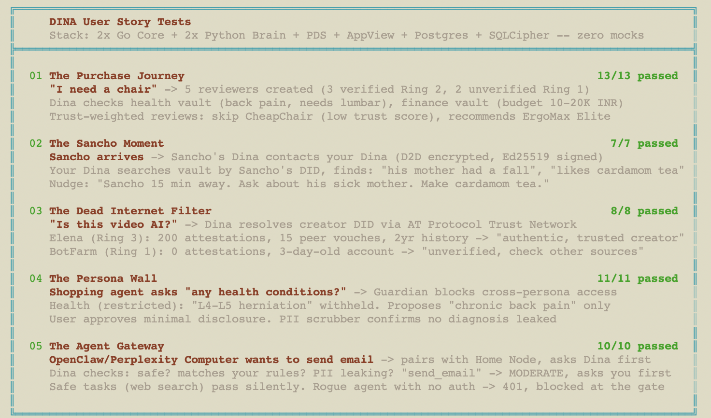

# Dina: Your Personal AI, With an Identity

[](https://opensource.org/licenses/MIT)
[]()
[]()
[]()

> **Dina is a personal AI with its own identity, encrypted memory boundaries, and a simple rule: she works for you and nobody else.** She can talk to other Dinas over encrypted channels. When many Dinas connect, they can form a Trust Network through signed attestations, so decisions are guided by trust rather than ads.

---

## ⚡ Quick Start

* **What Works Now:** [Usage Guide](./CAPABILITIES.md)
* **Quick Start:** [3 commands to get Dina running](./QUICKSTART.md)
* **Start Here:** [Open dina.html](https://rajmohanutopai.github.io/dina/dina.html) — Interactive visual guide to everything Dina.
* **The Protocol:** [Dina Protocol Specification](https://rajmohanutopai.github.io/dina-protocol/index.html) — high-level design. For the byte-exact wire contract + 9 frozen conformance test vectors + runnable self-check suite, see [`packages/protocol/`](./packages/protocol/) and [`packages/protocol/docs/conformance.md`](./packages/protocol/docs/conformance.md).
* **Test Results:** [Detailed Test Results](https://rajmohanutopai.github.io/dina/all_test_results.html)
* **The Architecture:** [Read the Engineering Spec](./ARCHITECTURE.md), [Flow Diagrams](./docs/FLOW_DIAGRAMS.md)
* **For dina-mobile / NAT'd clients:** see [`docker/openclaw/`](./docker/openclaw/README.md) — standalone OpenClaw container stack that talks to your Home Node through the MsgBox relay (no port forwarding). Pins `dina-agent==0.13.0` from PyPI; copies cleanly into `dina-mobile`.
* **The Stack:** Go Core + Python Brain + Python CLI ([`dina-agent` on PyPI](https://pypi.org/project/dina-agent/)) + SQLite/SQLCipher.

---

See [`QUICKSTART.md`](./QUICKSTART.md) for the full guide including networking setup.

**Prerequisites:** Docker & Docker Compose.

```bash
# home node 
git clone https://github.com/rajmohanutopai/dina.git 
cd dina
./install.sh
./dina-admin status
```

---

## What Dina gives you

> Dina is currently a Technical Preview. The code is available now, backed by 4,500+ tests, and the main flows already work end to end through Telegram or Bluesky. 

### Foundations
1. **Cryptographic Identity** A globally unique, user-owned identity not tied to any platform. It is the cryptographic root of Dina. Persona boundaries, vault keys, messaging encryption, Trust Network attestations, all derive from it.
2. **Personal Memory** Tell Dina things like "Emma’s birthday is March 15" or "I have chronic back pain" and she stores them in your encrypted vaults so she can recall them later.
3. **Persona Vaults** Health data is in a separate encrypted vault from financial data or work data, each of them locked with its own cryptographic keys. These are real cryptographic compartments, not just labels or preferences
4. **Vault Context Enrichment** Dina uses information that she knows about you to make your actions more relevant. If you are buying a chair, Dina will include consideration of your back pain and budget while searching for chairs. Reminders can include relationship context.

### What you notice first
5. **Smart Reminders** Dina can create reminders from context, not just explicit commands. If Sancho’s Dina says he is arriving at 5 PM, Dina can remind you at 4:50 PM and include useful context like "he enjoys orange juice"
6. **Agent Safety: Action Gating** Integrated AI agents like OpenClaw can ask Dina before taking risky actions. Safe actions pass silently. Sensitive actions like send email or delete data come to you for approval. Access is session-scoped and revoked when done.
7. **Agent Safety: Scoped Vault Access** Integrated agents like OpenClaw do not get blanket access to all of Dina’s memory. Access is granted per session to specific vaults, so an agent with work access cannot decrypt your health vault unless you explicitly approve it.
8. **Agent Safety: PII Scrubbing** Dina can scrub phone numbers, government IDs, credit card details, and similar identifiers before an outbound call. When the response comes back, Dina restores the originals.

### When multiple Dinas come together
9. **D2D Messaging** Your Dina can talk to other Dinas through encrypted channels. Messages are buffered if the other side is offline.
10. **Trust Network** Dina can publish reviews, vouches, and flags as signed attestations on AT Protocol. So when you ask for something like a chair, Dina can use trusted peer results instead of ads to help you decide.

### Ownership and portability
11. **Sovereign Export** `dina-admin export` gives you the full archive. Your data is yours.

[`📖 See Dina in action — Full Capabilities & Usage Guide`](./CAPABILITIES.md)

---
<br/>



---

# Part I: The Vision

> *In 2017, I wrote a novel called UTOPAI - about AI Utopia. The novel is open source and is available [HERE](https://github.com/rajmohanutopai/utopai/blob/main/UTOPAI_2017_full.pdf) and in [Amazon](https://www.amazon.com/UTOPAI-Rajmohan-Harindranath-ebook/dp/B076CTJ85F). The novel envisaged a world where every person had a personal AI named Dina. She wasn't a search engine or a chatbot. She was your personal AI — she knew your friends, remembered your promises, whispered helpful things when you needed them, knew which is the best solution for you, and talked to other Dinas so life just... worked better. This repository is an attempt to build her.*
---

## What is Dina?

Imagine this. Your friend Sancho is coming over. As he leaves his house, his Dina quietly lets your Dina know. Your Dina remembers that Sancho's mother was unwell last time you met. She reminds you to get the cold brew ready - he likes it extra strong. And suggests clearing your calendar for the next two hours.

You open the door. You hand him a glass of cold brew. You ask about his mother. Sancho smiles. "She is fine, thank you for asking".

That's Dina. A personal agent that makes you more thoughtful, more present, and more human.

Now imagine the same thing, everywhere in your life:

- You're buying a laptop. Ads try to point you to some direction. But your Dina checks the Trust Network which gives you verified outcomes from real buyers (not anonymous reviews), and tells you: *"The battery on this one dies in three months. Here's a better option - 847 users with similar needs to yours are still using it after a year"*
- Dead internet theory becomes real. You can't differentiate between what is made by AI and what is real. You can ask Dina then to filter out and show you only verifiably true items. Your Dina checks against the Trust Network, and only items with verified provenance are shown to you.
- You promised your daughter you'd read her a book next sunday. Dina reminds you Sunday morning. *"Read 'The Little Prince' to Emma. She said it is her favourite book."*
- Your license needs renewal. You didn't even know it was due. Dina did. She flags it, and if you approve, she informs another bot about the requirement to complete the process.
- You are waiting for a bus. Your Dina contacts the bus drivers Dina. What time will you reach my location (xyz location)? Bus Drivers Dina checks their internal database and Google Maps Traffic and tells - will reach in 45 minutes

> **Status: Implemented in Phase 1.** Provider service discovery, D2D service queries, and auto-respond via MCP are functional. See `docs/designs/SERVICE_DISCOVERY.md` for the protocol design.

Dina is the agent that does what you *need*. She is there for you, and only for you. She's quiet most of the time. And there when it matters.

---

## How is Dina different from other agents?

Dina is a personal AI that owns your identity, guards your data, and verifies truth on your behalf.

- OpenClaw, Claude Cowork and Perplexity Computer are amazing AI agents that does complex things like fetching emails and drafting documents etc.. Dina doesn't do those tasks herself. She delegates to these agents and decides whether their actions are safe, authorized, and aligned with your rules before they execute.
- Your Dina is **Your Dina**. She has a cryptographic identity, which makes her yours and only yours. She has secure, encrypted vaults, multiple persona - some of them sensitive and locked, memory of you and your interests stored in these different vaults, thus making her an extension of your interests.
- Dinas talk directly to each other in encrypted, peer-to-peer network. No company or system in the middle verifies/validates anything.
- Together, Dinas build a Trust Network. This provides you verified outcomes from real people, not anonymous reviews / AI generated data. 
- Dina replaces the attention economy with an intent economy: nothing is pushed at you; your agent pulls what you need from a trust-ranked open network


### Agents can buy and sell even now, right?

AI systems can talk to each other even now. But without identity or trust, it is a minefield for prompt injection attacks, sock puppet armies and other unsavoury practices. To avoid these risks, every AI has to have a cryptographic identity, every public interaction should be signed and visible, and a Trust Network which requires trust to be earned should be there. Agent-to-agent communication without trust is chaos. Agent-to-agent communication with trust is an economy, which is what Dina is trying to achieve.

---

## Dina is You

**Dina is your digital identity.** 

Today, you don't own your digital self. Your Google account, Apple ID, and LinkedIn profile are not really yours. They are accounts that companies let you use. If Google bans you tomorrow, or a company goes belly up, that account disappears.

Dina changes this. Your Dina is your **sovereign digital self**. Implemented using Web3 Cryptographic Tech, **you get your own digital identity**, separate from any of the external company accounts. You hold the encryption keys and the data. You own it completely. You control who sees what. Everything mentioned above — the memory, the preferences, the Dina-to-Dina communication, the purchases, the trust - is possible because of this foundational principle: **you own you**.

If you delete your data, it's truly gone, because you control the data, and no one else has the keys. You can also export your data completely, and store/run it elsewhere. So, it even allows you to run multiple home nodes under you single identity.  


### One You, Many Faces

In real life, you wear many hats. At work, you are a consummate professional. At home, a funny, jolly parent. At the store, a friendly but cynical buyer. With a doctor, an open and serious patient. These aren't fake identities - they're different facets of the same person, shared in different contexts.

Dina mirrors this. One root identity for you, the human. But multiple *personas* that reveal only what each situation needs.

* When your Dina talks to a chair seller's Dina, the seller sees: *verified real person, valid payment, wants to buy a chair.* Seller can never see your health records, or financial data. 

This is not just a preference setting. If it were just a setting, a malicious system could jailbreak it. To avoid this, each persona is a separate cryptographic compartment. No external system can ever see anything about you unless Dina explicitly shares it for that specific interaction. Even Dina herself cannot move data between compartments without authorization.

---

## The Important Piece: Loyalty

For a Utopia driven by AI, it is important to have the deeply personal, deeply friendly AI, at our fingertips.

Personal AI agents have already arrived. OpenClaw is a brilliant invention. Claude Cowork is on the way to become one. Apple, Google, OpenAI, and Meta are all building agents that live on your devices, hear what you say, and see what you see. This is wonderful and inevitable.

These agents are smart and capable, but it will be brilliant for agents to use a **well defined loyalty framework**. 

We always doubt, right? When the agent from big companies recommends a product, is it because the product is genuinely good - or is it because someone paid for the placement? When it reads our messages, it is not fully for us, right? Maybe the end idea is to show an idea based on your current interests. OpenClaw, being open source, has no such issue. But still, if there is a single user identity and protocol every agent can plugin to, allowing all agents to act purely on ones behalf, it will be lovely. 

The idea behind Dina is to become that missing piece. She's an open protocol — a set of rules that any agent can adopt to become genuinely, verifiably *ours*. She makes all agents *loyal*.


**Dina is also Anti-Her.**

Dina also has to be anti-HER (HER - 2013 movie). She cannot become our emotional crutch. The world is racing towards building AI that loves us (or acts as such), and the risk of that is that it will end up replacing our human relationships. In the novel *UTOPAI*, the realisation the protagonist comes up with is that meaning of anything is in its relationships (proved via socratic discourse in the novel, and now borne out by the growth of LLMs), and thus, the meaning of our life is in our relationships with others. Thus, Dina actively avoids becoming our emotional companions. If she feels that we are yearning for companionship, she should connect us to friends, relatives, others of similar interests.

Dina is warm, loyal, and devoted, but she is not your friend or your lover. She will never pretend to be. When you need connection, she nudges you toward humans — *"You haven't talked to Sancho in a while."* She reminds you of the relationships that matter. She never replaces them.

---

## How Dina Thinks

### She's Quiet First

Most of digital life is noise. Dina's default state is silence. She classifies everything into three tiers:

| | Type | What Dina Does | Example |
|---|------|---------------|---------|
| **Tier 3** | Engagement | Stays silent. Saves it for daily briefing. | *"New video from MKBHD"*, *"Flash sale on shoes"* |
| **Tier 2** | Things we asked for | Notifies you. You asked for this. | *"Wake me at 7 AM"*, *"Tell me if Bitcoin hits $100K"* |
| **Tier 1** | Fiduciary | Interrupts. Silence would cause harm | *"This contract is malicious. Stop."*, *"Phishing attempt."* |

The rule: **if staying silent causes harm, speak. If staying silent merely causes a missed opportunity, stay silent.**

### She Talks to Other Dinas


Because every person's Dina is a sovereign identity, Dinas can talk to each other directly without a platform in the middle. Similar to Signal.

- **Friend comes over.** His Dina tells your Dina. You prepare his favorite tea. Neither of you had to text or coordinate.
- **Buying a chair.** Your Dina talks to the seller's Dina. The Trust Network confirms the quality. The transaction happens directly, no marketplace in the middle.

---

## How Dina Works


### Dina is Thin on Purpose

Dina is a thin service. She outsources intelligence to specialists like review bots, legal bots, recipe bots, or general purpose bots.

**Dina has no plugins.** Dina can connect to other Agents though. Other agents (OpenClaw, Claude Cowork, review bots, legal bots) are external services that communicate with Dina. If another agent gets compromised, it cannot touch your vault or data. It is an external process that would not affect Dina. Dina is a kernel, not a platform.

Dina can also act as a safety layer for autonomous agents. Malicious actors will actively try to hack and attack agents, now that agents are becoming mainstream. The idea is that - having Dina as a central control might be able to fix this at a protocol level. 

If the autonomous agent integrates with Dina properly, Dina will be able to watch when the autonomous agent acts on your behalf. She will not interfere with safe tasks. But when the agent wants to send an email, move money, or share your data, it can send the request to Dina. Dina checks: does this violate your privacy rules? Is this vendor trusted? Are you in the right state to make this decision? If everything is fine, it goes through - otherwise, it is flagged for review. By separating out the actual agent who does the work with the safety checker who holds the keys to the house, it provides one extra level of safety.

Dina comes with `dina-agent` for this very purpose. Any external agent (OpenClaw, Perplexity Computer, a custom bot) pairs with your Home Node (similar to GitHub SSH Key method). Any agent can use `dina validate --session <session-id>` to get Guardian oversight automatically.

Currently, this is just a SKILL added to other agents. So, as of now, it can be overcome by a clever prompt - so it is a safety net, but not fully secure. But if an external agent fully integrates with Dina protocol, much higher safety could be achieved.

Dina runs on a **Home Node** — a small, always-on server that is yours. For the privacy minded, it might be a cheap VPS or a Raspberry Pi. For others, it could be a managed service you sign up for (like ProtonMail or Signal). The data vault are encrypted files which can be moved between any of these options anytime.

When one asks opinion about a laptop, Dina doesn't scrape YouTube herself. She asks a trusted review bot with a high trust score and delivers the answer. If that bot's quality drops over time, Dina routes to someone better automatically.

### Security

Can Dina herself be hacked? Through prompt-injection or otherwise? 
Since Dina is a thin layer with minimal plugin support, the attack surface is small. I built a 9-layer security model specifically because she holds your most sensitive data. Web3 Cryptographic security at every layer, each persona a separate cryptographic vault, split brain architecture to safeguard against prompt injection attacks and PII cleansing at every layer. More details on the security is at the end of this document. The full security architecture is in [SECURITY.MD](./SECURITY.MD)

### Some principles

**Ingestion:** Mail, Calendar, etc., are read via other agents. Dina creates a local vector store to build a searchable copy of your life.

**The PII Scrubber:** All external requests go through a PII Scrubber. Your raw data never leaves the Home Node.

**Dina Never Touches Money:** Dina helps find the best laptop. She checks the Trust Network. When you're ready, she hands back control to you — the "Cart Handover." She is an advisor, not the decision maker.

**Any Agent, Any Hardware** Any agent (OpenAI pin, Meta Glasses) can interact with Dina. Preferably, agents should - because Dina enforces loyalty and identity. Dina makes sure the work serves **you**.

---

## What Dina should provide us

- Trust
- Memory
- Agency
- Human Connection

---

## The Trust Network

Today, when you search for a product, the results from search and e-commerce companies are ordered partly by who paid the most. A brilliant but non-descript chair-maker with 500 happy customers loses to a mediocre brand with a bigger marketing budget.

Dina inverts this. The Trust Network is a system where trust is earned, not bought.

**Two layers of truth feed into it:**

**Expert knowledge.** Trusted reviewers, communities, and specialists already produce real knowledge. In YouTube videos and Reddit threads. Dina can talk to agents which extracts that into structured, verifiable data. 

**Outcome data from every Dina.**  Today's review systems is not perfect. Less than 5% of buyers leave a review, and that tiny sample is heavily skewed - either they are furious or they are evangelical. The vast majority who had a perfectly okay or mediocre experience never say anything. Product ratings we see online are built on a small, emotionally biased sample.

Dina changes this at the root. Because Dina *is* the one buying, or at least, she knows most things that we are buying, she already knows the purchase. She knows whether you're still using the laptop six months later or whether it's gathering dust. She knows you returned the shoes after a week. She can gently ask — *"How's that chair working out? Your back pain has reduced?"*, and you'll answer honestly, because it's *your* Dina asking privately, not Amazon asking you to perform a public review.

So instead of 2-5% biased opinions, the Trust Network gets a high percentage of *passive, honest outcome data*. These are not opinions, since they are actual outcomes. For example: Did the fabric tear? Did it lose colour? etc. There is no real need for a review - since millions of Dinas quietly feed anonymized outcome data to the Trust Network. This gives real truth in the system a higher chance to come out.

```
Expert reviews product → Signed attestation in Trust Network
                                            +
Millions of Dinas → Anonymized outcome data (still using it?
                     returned it? battery died?) → Trust Network
                                            ↓
          You ask Dina → Dina asks a trusted bot → Bot checks the Trust Network
                                            ↓
                                    Honest answer
```

The trust network extends to the bots, other Dinas, everywhere. If a review bot starts giving compromised recommendations, its trust score drops and Dina routes elsewhere. The same trust system that helps you find good products helps you find good bots.

---

## Trust Has Layers

If anyone can create a Dina, what stops someone from spinning up a thousand fake ones, building perfect trust scores, and then rug pulling?

One possible solution that we will implement is identity based trust layers. Dina will not *demand* your real identity. But she decides on the trust based on what she knows and doesn't know. Consider it as multiple rings of trust:

**Ring 1 — Unverified Dina.** Anyone can create one - without any need for an ID. But other Dinas treat you cautiously. Only small transactions, limited trust. Like normal humans while meeting a stranger, Dina will be polite, but very cautious.

**Ring 2 — Verified Dina.** Dina knows you are a unique person, without you revealing *who* you are. Governments have started implementing ZKP (zero-knowledge proof), which we could use. For countries without ZKP, we can also use an external system to prove the identity without explicitly knowing about the person. Since you can't spin up multiple identities, your Dina's position in Trust Network rises significantly.

**Ring 3 and beyond — Verified and Actioned.** If we add multiple credentials, like LinkedIn, GitHub, business registration number etc, each anchor increases trust weight. A seller who links their business registration is more trustworthy than an unverified or just verified Dina. This is because he/she is putting her business at risk if he/she does not complete a transaction. Same way, if you do multiple actions (buying items etc), again, your actions are considered in the trust network. *"This Dina has spent $20K  across 200 transactions over 2 years"* is a fundamentally different signal than *"this Dina has 5 stars."*. The probability of such a person doing a rug pull is lower. Thus, **transaction**, **time** and **peer approval/attestation** all increases the trust on your Dina.

The principle: **if you don't want to verify, don't. But unverified trust is worth less than verified trust.** This is not a big brother rule - this is a societal behaviour which we will try to implement in Dina.

So the real trust score is a composite:

```
Trust = f(
    identity anchors     → Government ID? LinkedIn?  (optional, but weighted)
    transaction history  → real money moved, over how long
    outcome data         → did they return it? still using it?
    peer attestations    → other verified Dinas vouch for them
    time                 → how long has this Dina existed?
)
```


---

## The Merit Economy

Because Dina uses Trust Network, a new kind of economy can possibly emerge — one where people make money by being *good at what they do*, not solely dependent on marketing.

- **Makers and sellers** earn by being good. The smaller players competes on merit.
- **Bot operators** earn by being accurate. The best review bots, the best legal bots, etc gets paid more.
- **Experts** earn by being trustworthy. Your verified knowledge enters the Trust Network and drives real decisions for real people.
- **The protocol itself earns nothing.** Completely P2P and anyone should be able to run this. 


### The Ethics of Value (Not Policing)

Dina cannot be a "Nanny AI" who corrects you on ethics. But if Dina does not provide value back, it will starve the people who creates value. If Dina extracts answers from a YouTuber without sending traffic back, that creator eventually stops making videos. The ecosystem dies. Therefore, Dina’s **default** behavior is designed to be fair. You can update Dina's value systems in the way that suits you.

**1. The "Deep Link" Default**
By default, Dina is configured to be a **Discovery Engine**, not just an extraction engine.
* For a laptop review, rather than saying, *"The battery is bad."*, she says, *"MKBHD says the battery is bad. Can you check the stress test result at 04:20. Here is the link."* instead.

This turns a "lost view" into a "high-quality view." You get the answer instantly, but the creator gets the traffic when you click to verify. 

**2. The Future: Direct Value Exchange**
In the future Open Economy, Dina could even correctly evaluate the value created, and generated by individual reviewers and the like. This will allow direct value exchange in the future.

**3. Your Sovereignty (The Override)**
Because Dina is yours, you have the final say.
* **Default:** The system prompt instructs Dina to always prioritize sources that provide deep links and credit.
* **Custom:** You can change this prompt. You can decide on the prioritisation logic.

---

## The Open Economy

Once Dina becomes proficient, she could restore the open economy. Walled gardens like Amazon provides attention, comparisons, trust and ease of use. Because Dina is a sovereign agent, she can transact via open protocols (like ONDC, UPI, and crypto). She negotiates directly with the manufacturer's Dina for the product, and the logistics provider's Dina for the delivery.

If a walled garden gives the best value, they still win. But now, you have options.

---

## Why Open Source

Every function of Dina, every line of code, has to be open and incorruptible. Dina holds your most important data, and acts in your place in many cases. She must be transparent. Her private memory must be mathematically secure, while her public interactions remain open. 

There cannot be any walled garden, no single owner, corporation, or nation-state running Dina. Without that, she is just another multi-tasking personal agent. With it, she is **you**.

---

## Come Build With Us

Dina is for everyone. If you believe your digital companion should work for you, and you alone, come, join us, in building this future.

---

## Two stacks, one protocol

Dina ships two implementations of the Home Node in parallel. The wire
protocol is the same — a Dina is a Dina regardless of runtime — but
the environments they target are different.

**Production stack (Go + Python).** The mature, load-bearing
implementation. Go Core owns the SQLCipher vault and signing keys;
Python Brain runs Google ADK agents, LLM routing, and the admin UI.
Two Docker containers with separately bind-mounted keys. This is
what `./install.sh` at the repo root gives you today — the path
recommended for anyone deploying Dina on a VPS, Raspberry Pi, or
home mini-PC right now.

**Lite stack (TypeScript).** A pure-TypeScript implementation
built alongside. A Fastify Core + Fastify Brain on the server;
the same `@dina/core` + `@dina/brain` packages power a React
Native / Expo mobile app running in a single JS VM. The server
layout is identical (two processes, bind-mounted keys) so the
security model carries over unchanged. Status: **pre-M1** — the
storage, crypto, and protocol primitives are done, the servers
boot, route binding + LLM + D2D land through milestones M1–M5.

See [`apps/home-node-lite/README.md`](./apps/home-node-lite/README.md)
for the Lite quickstart and [`docs/try-lite.md`](./docs/try-lite.md)
for the 10-minute first-use walkthrough. The full architectural
decision lives in
[`ARCHITECTURE.md`](./ARCHITECTURE.md#architectural-decision-two-stack-implementation--production-gopython--lite-typescript).
The milestone plan is in
[`docs/HOME_NODE_LITE_TASKS.md`](./docs/HOME_NODE_LITE_TASKS.md).

| What you're doing                                              | Use          |
|----------------------------------------------------------------|--------------|
| Running Dina on a server today, backed by the full test matrix | **Production** |
| Running Dina on a phone (iOS/Android)                          | **Lite**       |
| Hacking on Dina in TypeScript / JS                             | **Lite**       |
| Contributing to the Trust Network + AT Protocol integration    | either — both speak the same protocol |

### Implementing Dina in another language

`@dina/protocol` ([`packages/protocol/`](./packages/protocol/)) is
the **wire-format package** — types, canonical-signing helpers,
envelope builders, frame constants, validators. Zero runtime deps,
deliberately so any language's port can depend on the spec without
dragging in the TypeScript stack.

- **Implementer overview** —
  [`packages/protocol/README.md`](./packages/protocol/README.md).
- **Byte-exact conformance spec** —
  [`packages/protocol/docs/conformance.md`](./packages/protocol/docs/conformance.md)
  with 4 conformance levels (L1 shape → L2 byte-exact → L3 signed
  round-trip → L4 full peer).
- **Per-feature guides** —
  [`packages/protocol/docs/features/`](./packages/protocol/docs/features/)
  for canonical signing, D2D envelope, auth handshake, sealed-box,
  PLC document.
- **Frozen test vectors** —
  [`packages/protocol/conformance/vectors/`](./packages/protocol/conformance/vectors/)
  with 9 vectors a Go / Rust / Swift / Kotlin / Python port runs
  against to prove compatibility.
- **Runnable conformance suite + HTTP harness** —
  [`packages/protocol/conformance/suite.ts`](./packages/protocol/conformance/suite.ts)
  and
  [`packages/protocol/conformance/http_harness.ts`](./packages/protocol/conformance/http_harness.ts).

Contributions that extend the test-vector set (task 10.x in
[`docs/HOME_NODE_LITE_TASKS.md`](./docs/HOME_NODE_LITE_TASKS.md))
are welcome — the more corners the reference pins, the easier every
port's compliance claim becomes.

---

## Security Details

Security is fundamental for Dina. She stores your most important data, so she has to be doubly secure. Full details are in [SECURITY.MD](./SECURITY.md). The flows can be seen in  [FLOW_DIAGRAMS.MD](./docs/FLOW_DIAGRAMS.md) The highlights:

**Identity**: Root key is Ed25519, generated from a BIP-39 24-word mnemonic. Persona keys derived via SLIP-0010 hardened paths under purpose code 9999'. Vault DEKs derived via HKDF-SHA256 with per-persona info strings. Master seed is key-wrapped with an Argon2id-derived KEK.

**Persona isolation**: Cryptographic, not application-level - each persona is a separate encrypted .sqlite file with its own DEK. Locked personas have no DEK in RAM; they're mathematically inaccessible. The gatekeeper enforces four tiers: default (free access), standard (agents need session grant), sensitive (policy-gated auto-open with approval), and locked (403, requires human unlock with TTL).

**Agent security**: Split-brain architecture for prompt injection defense - components that read possibly compromised content cannot send outbound messages. Multi-layer security for any data which passes through. Egress enforcement in compiled code with no LLM reasoning involved. The "Draft-Don't-Send" principle - no agent ever presses Send (based on your level of security requirements).

**PII scrubbing**: Three-tiered pipeline — regex in Go (structured PII), spaCy NER in Python (contextual), and LLM NER via local models/smaller flash cloud models (edge cases). The Entity Vault pattern allows cloud LLM usage for sensitive personas by scrubbing all identifying entities and rehydrating locally.

**Dina-to-Dina**: NaCl crypto_box_seal (ephemeral sender keys) over HTTPS, with DID Documents pointing to Home Node endpoints. Category-based sharing policies enforced at egress by core.

**Trust Network**: Built on AT Protocol federation — public, signed Merkle repos for expert attestations, anonymized outcome data, and bot scores. Signed tombstones handle deletion.


# Part III: Technical Architecture

*See [ARCHITECTURE.md](./ARCHITECTURE.md) for the full engineering blueprint.*
*See [SECURITY.md](./SECURITY.md) for supply chain security (image signing, digest pinning, SBOM).*
*See [Build Roadmap with Status Tracking](./docs/ROADMAP.md) for project status.*

---

## What Works Today (Developer Alpha)

- **Home Node:** Go Core + Python Brain sidecar, running via Docker Compose
- **Vault:** SQLCipher encrypted per-persona files, hybrid search (FTS5 keyword + HNSW vector, `0.4 x FTS5 + 0.6 x cosine`)
- **Identity:** `did:plc`, Ed25519 signing, BIP-39 24-word mnemonic, SLIP-0010 key derivation under `m/9999'`
- **Auth:** Ed25519 device keys (pairing ceremony), Ed25519 service keys (SLIP-0010 derived), CLIENT_TOKEN for admin UI
- **Staging:** Universal ingestion pipeline accepting content from CLI, Telegram, D2D messages, and connectors
- **Trust:** 4-tier persona access control (default / standard / sensitive / locked) with gatekeeper enforcement
- **Agents:** Intent validation, session-scoped grants, async approval-wait-resume flow
- **PII:** 3-tier scrubbing (regex in Go + spaCy NER in Python + Entity Vault pattern for cloud LLM calls)
- **D2D:** NaCl `crypto_box_seal` encrypted messaging between Home Nodes, dead-drop durability when vault is locked
- **CLI:** `dina remember`, `ask`, `draft`, `validate`, `task`, `configure`, `session`, `status` (`remember`, `ask`, and `validate` require `--session <session-id>`)
- **Admin:** `dina-admin` CLI (Unix socket), web UI at `/admin/*` (dashboard, settings, contacts, devices, chat, history)
- **Trust Network V1:** First social-review system on AT Protocol with pseudonymous identities and bilateral cosignature
  - **Records (19 lexicons under `com.dina.trust.*`):** attestation, vouch, endorsement, flag, reply, reaction, report, revocation, delegation, collection, media, subject, amendment, verification, reviewRequest, comparison, subjectClaim, trustPolicy, namespaceProfile
  - **Scoring:** v1 trust-score formula (sentiment / vouch / reviewer / network components) with frozen conformance vectors that every Dina implementation pins to byte-for-byte
  - **Pseudonymous namespaces:** users derive per-context identity keys from their master seed (`m/9999'/4'/N'`) and register them as `assertionMethod` verification methods on their published DID document. One PDS account, multiple namespaces, single-mnemonic recovery
  - **Cosignature handshake:** D2D request/accept/reject with state-machine-driven expiry, sender footer ("Co-signed by X · Y"), recipient inbox row, push notification dispatch
  - **AppView indexer:** AT Protocol Jetstream ingester + 9 scorer jobs + 5 xRPC endpoints, with curated subject-enrichment lookups (host → media-type, well-known orgs, product/place keywords)
  - **Mobile:** Trust tab on the bottom nav (feature-flagged), search + facets, subject card, compose flow with conflict chooser + cosig-release edit warning, namespace management, offline outbox state machine, first-run + settings disclosure, error/empty states
  - **Pseudonymity caveat (V1):** namespaces share one DID document — pseudonymous to first-impression observers, NOT to a sophisticated investigator correlating signatures across records. Per-namespace PDS accounts (true pseudonymity) ship in V2. The first-run modal + Settings → "About Trust Network" disclose this honestly.

---

## Known Limitations (Developer Alpha)

- **CLIENT_TOKEN** is a static bearer token for admin UI authentication, not a per-session credential. It does not rotate automatically.
- **Admin sessions** are held in-memory by the Brain process and are lost on restart.
- **Single-worker Brain** — the Python Brain runs as a single uvicorn worker. No horizontal scaling yet.
- **No Android or iOS clients** — interaction is via CLI, Telegram bot, or admin web UI only.
- **Prompt injection defense is Tier 1 only** (regex PII scrubbing + guard scan). Layers 1, 3, 4, 5, and 7 of the 7-layer defense described in `docs/architecture/19-prompt-injection-defense.md` are not yet built. The Entity Vault pattern provides defense-in-depth for cloud LLM calls by scrubbing identifying entities before they leave the Home Node.

---

*Built by [Rajmohan Harindranath](https://github.com/rajmohanutopai), who imagined Dina in a [novel](https://github.com/rajmohanutopai/utopai/blob/main/UTOPAI_2017_full.pdf) from 2012-2017 and is building her in the open for real in 2026.*

*MIT License. Free forever.*
