# Dina Flow Diagrams

Architecture flow diagrams covering every security and data path. All diagrams are Mermaid and render natively on GitHub.

---

## 1. Authentication Paths

**Use case:** Every HTTP request to Core must be authenticated. A CLI command, a Brain API call, an admin UI action, and a connector push all take different auth paths that produce different permissions.

**Example:** When you run `dina recall "office chairs"`, the CLI signs the request with your device's Ed25519 key. Core verifies the signature, sets CallerType=agent, and checks the device allowlist before forwarding to Brain.

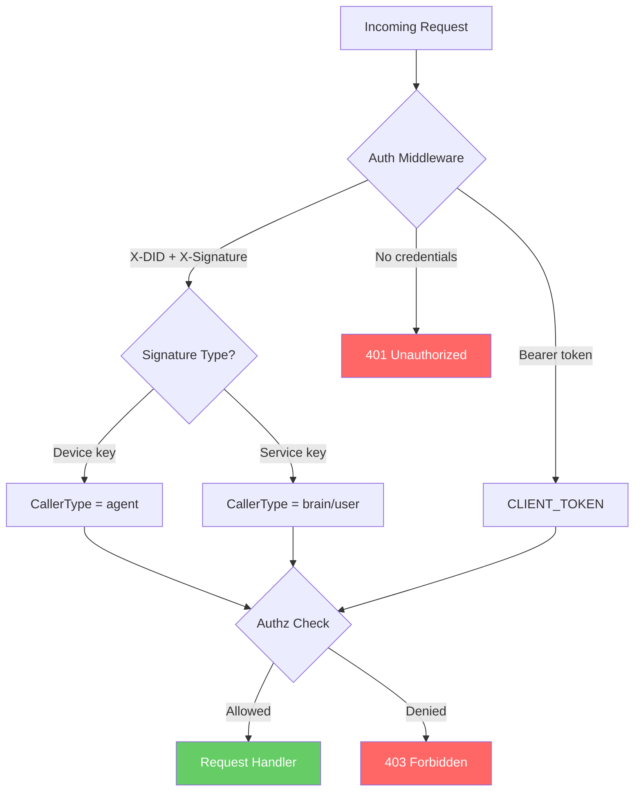

---

## 2. Per-Service Authorization

**Use case:** Brain, admin, and connectors each get minimum-privilege access. A compromised connector cannot read vault data. A compromised admin backend cannot access vault contents.

**Example:** A Gmail connector can push emails to `/v1/staging/ingest` but cannot call `/v1/vault/query` to read your health data. Brain can read/write vaults but cannot sign DIDs or export backups.

| Endpoint | Brain | Admin | Connector |
|----------|:-----:|:-----:|:---------:|
| `/v1/vault/query` (read) | **yes** | no | no |
| `/v1/vault/store` (write) | **yes** | no | no |
| `/v1/staging/ingest` | **yes** | no | **yes** |
| `/v1/staging/claim` | **yes** | no | no |
| `/v1/persona/unlock` | no | **yes** | no |
| `/v1/devices` | no | **yes** | no |
| `/v1/export` | no | **yes** | no |
| `/v1/pair` | no | **yes** | no |
| `/v1/did/sign` | no | no | no |
| `/v1/did/rotate` | no | no | no |
| `/healthz` | **yes** | **yes** | **yes** |

Unknown service IDs are denied on all paths (fail-closed).

---

## 3. Signing Protocol

**Use case:** Every Ed25519-signed request includes a random nonce so identical payloads within the same second produce different signatures, preventing replay rejection.

**Example:** The CLI runs `dina remember "buy milk"` twice in one second. Each request gets a unique nonce, so Core accepts both instead of rejecting the second as a replay.

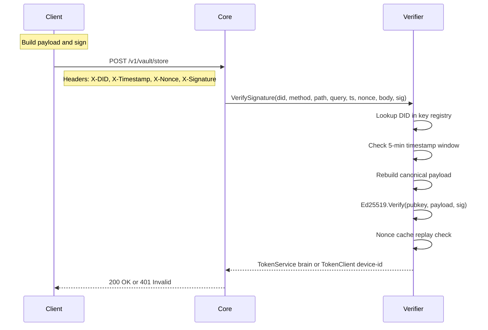

---

## 4. Agent Reasoning Flow

**Use case:** User asks Dina a question. The CLI sends the query to Core, Core proxies to Brain, Brain's LLM autonomously decides which persona vaults to search, and returns a personalized answer with source citations.

**Example:** You run `dina recall "I need a new office chair for my back pain"`. Brain searches the consumer vault for chair preferences and the health vault for your back condition, then synthesizes an answer: "Given your L4-L5 disc herniation, I recommend a chair with strong lumbar support."

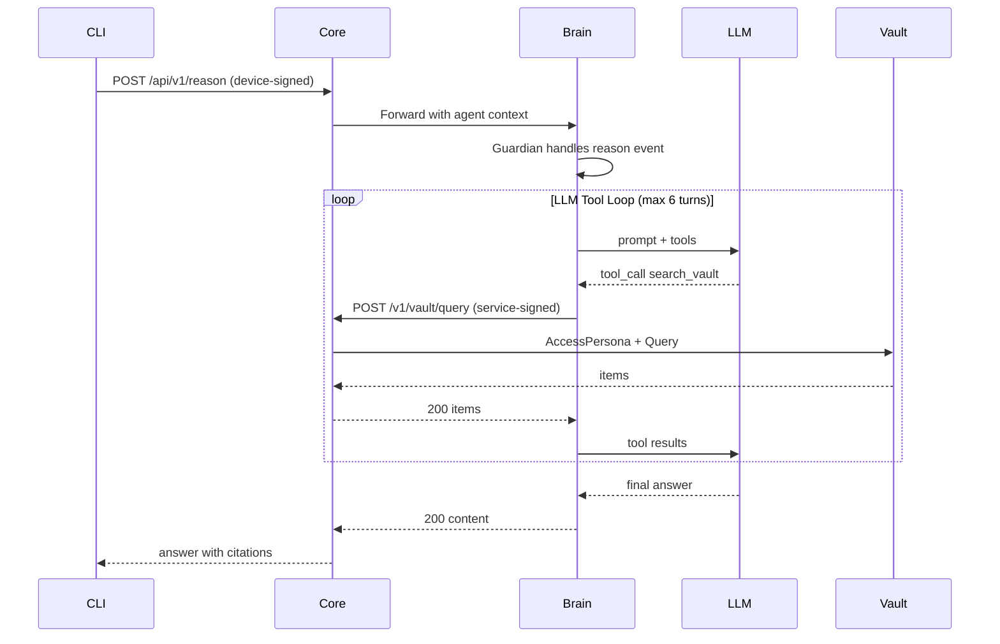

---

## 5. Approval Lifecycle

**Use case:** An agent tries to access sensitive health data. Core blocks it, creates an approval request, and notifies the user via Telegram. The user approves from their phone, and the next query succeeds.

**Example:** OpenClaw agent researching office chairs triggers a health vault search for "back pain". Core returns 403 approval_required. You get a Telegram message: "Agent requests health access for chair-research session." You reply `approve apr-123`. The agent retries and gets the data.

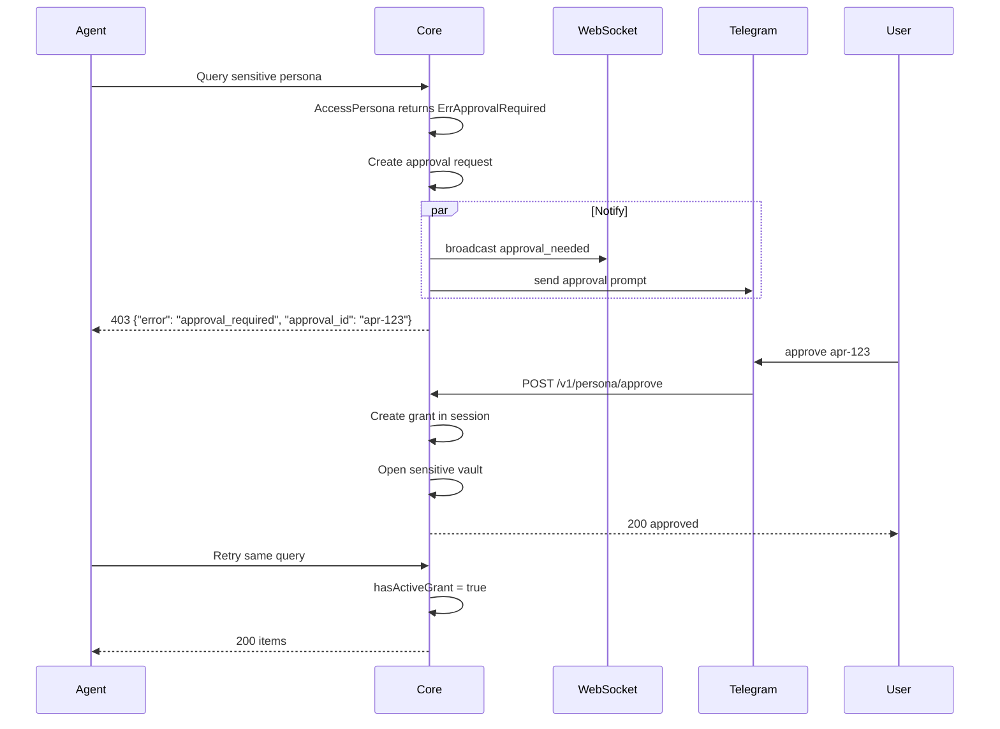

---

## 6. Persona Tier Enforcement

**Use case:** Four tiers control who can access each persona's data. Default is always open. Standard requires agents to have a session grant. Sensitive requires explicit user approval. Locked requires a passphrase.

**Example:** Your "general" persona (notes, bookmarks) is open to everyone. Your "health" persona (medical records) requires approval — an agent can't read it without your explicit consent via Telegram.

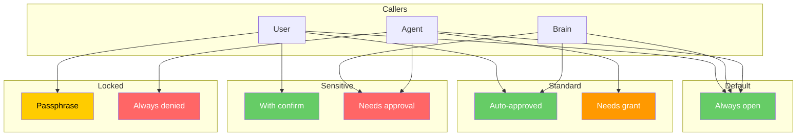

---

## 7. Agent Session Lifecycle

**Use case:** Agents work within named sessions that scope their access grants. When you end a session, all grants are revoked and sensitive vaults auto-close.

**Example:** OpenClaw starts a "chair-research" session, gets approval for health data, queries successfully. When the session ends, the health grant is revoked. A new session starts clean — no inherited permissions.

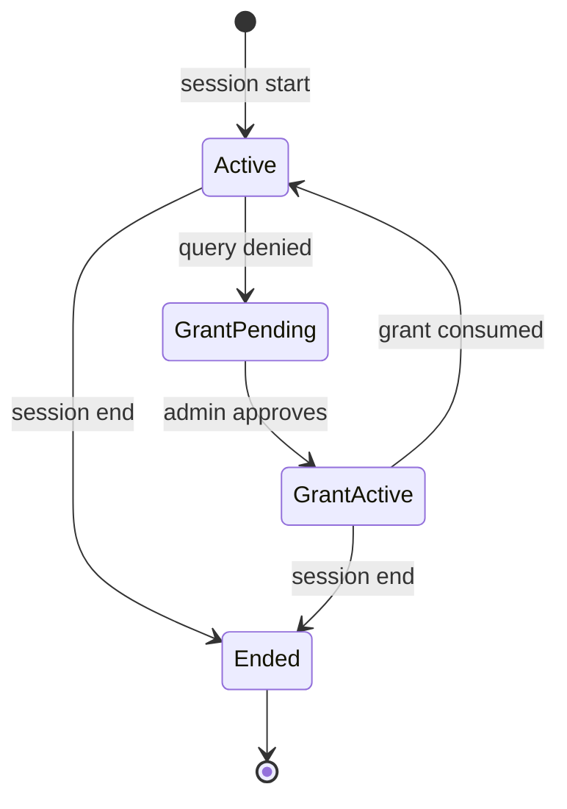

---

## 8. Connector Staging Pipeline

**Use case:** Connectors (Gmail, Calendar) push raw emails to Core's staging inbox. Brain claims items, classifies them into the right persona, and Core stores the classified result. Raw data is transient — only classified data lives in vaults.

**Example:** Gmail connector pushes an email from Dr. Sharma about blood test results. Brain classifies it as health persona, scores trust as "service/high/normal", generates L0/L1 summaries, and Core stores it in the health vault. A spam email from an unknown sender gets classified as "unknown/low/caveated" and quarantined.

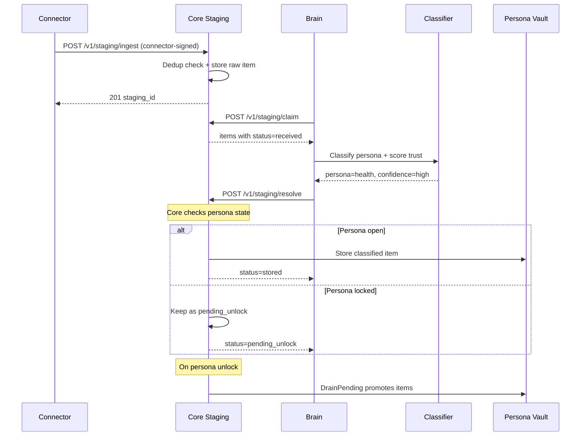

---

## 9. Staging Item State Machine

**Use case:** Each staged item moves through a well-defined state machine. Leases prevent duplicate processing. Expired items are automatically cleaned up.

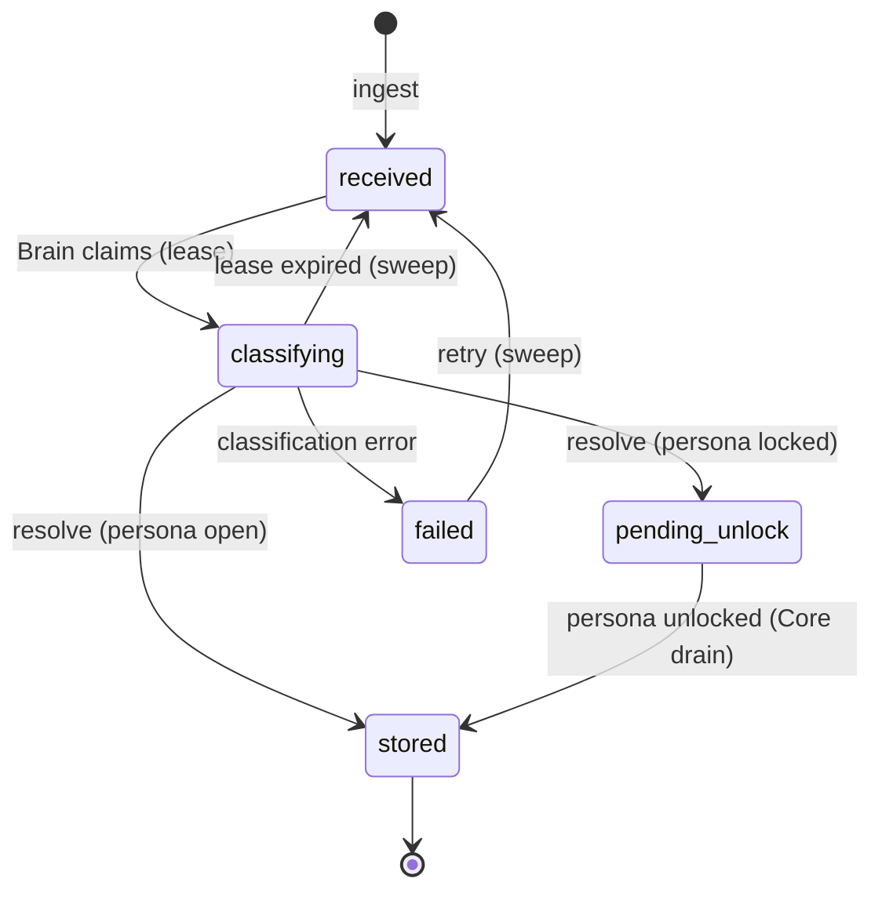

---

## 10. Source Trust and Provenance

**Use case:** Every vault item carries metadata about who sent it and how reliable it is. Spam health claims are quarantined, not mixed with doctor reports. The LLM cites sources and caveats unverified claims.

**Example:** Dr. Sharma's email about blood tests gets `sender_trust=contact_ring1, confidence=high, retrieval_policy=normal`. A spam email claiming vitamin D deficiency gets `sender_trust=unknown, confidence=low, retrieval_policy=caveated`. When you ask about health issues, Dina says "You have L4-L5 disc herniation based on Dr. Sharma's reports" — not "You have vitamin D deficiency."

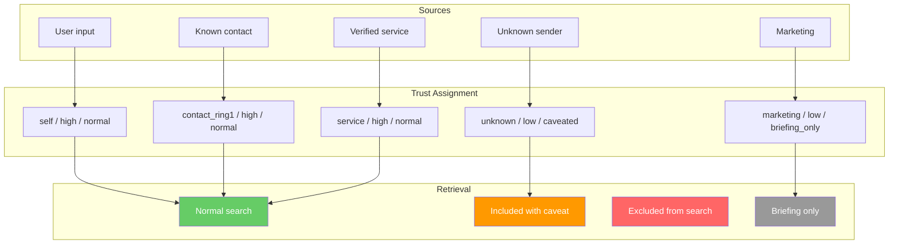

---

## 11. Tiered Content Loading (L0/L1/L2)

**Use case:** Brain loads content progressively — one-line summaries for scanning, paragraph overviews for answering, full documents only for deep dive. This reduces prompt tokens from ~50K to ~5K.

**Example:** A search returns 20 vault items. Brain sees L0 ("Blood test from Dr. Sharma, March 2026") for all 20, reads L1 (key findings: B12 low, all else normal) for the top 5, and only loads full L2 content for the one item the user asks about specifically.

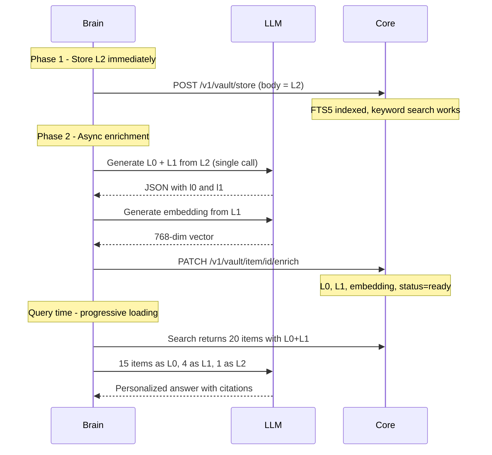

---

## 12. Vault Write Path (dina remember)

**Use case:** User saves a quick note via CLI. The item goes through Core's remember endpoint, which wraps staging ingest + Brain drain + completion polling into a single synchronous call. Brain classifies the content into the right persona, enriches it (L0/L1 summaries, embedding), and resolves it into the vault. Session is required.

**Example:** You run `dina remember "Buy ergonomic chair with lumbar support" --session chair-research`. The CLI posts to `/api/v1/remember`, Core stages the item, triggers Brain drain, and polls for up to 15 seconds. Brain classifies it into the general persona, enriches it, and resolves it. Core returns `{"status": "stored"}`. If the target persona requires approval, Core returns 202 with `{"status": "needs_approval"}`.

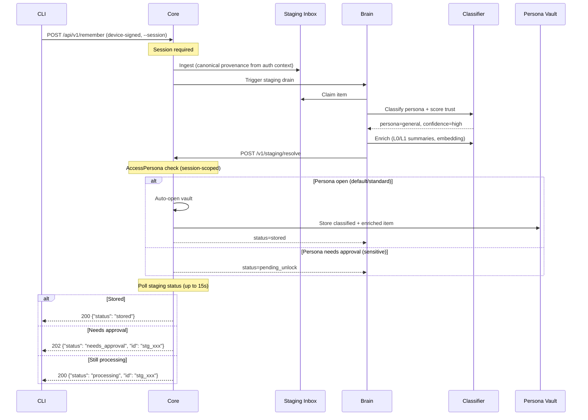

---

## 13. Admin UI Authentication

**Use case:** You open the admin dashboard in a browser. The browser authenticates with a passphrase, gets a session cookie, and Brain proxies vault operations to Core using CLIENT_TOKEN.

**Example:** You navigate to `https://dina.local/admin/`, enter your passphrase, and see pending approval requests. You click "Approve" on an agent's health access request.

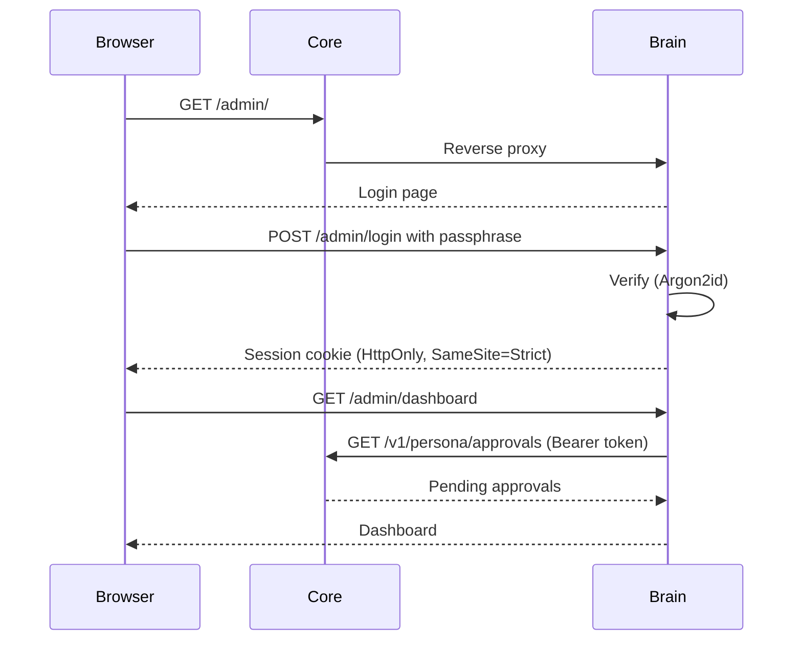

---

## 14. WebSocket Authentication

**Use case:** Paired devices maintain a persistent WebSocket connection for real-time push notifications (approval requests, vault updates, nudges). The upgrade must be Ed25519-signed — no token handshake.

**Example:** Your phone connects via WebSocket. When an agent requests health access, Core pushes the approval notification instantly to your phone via the WebSocket.

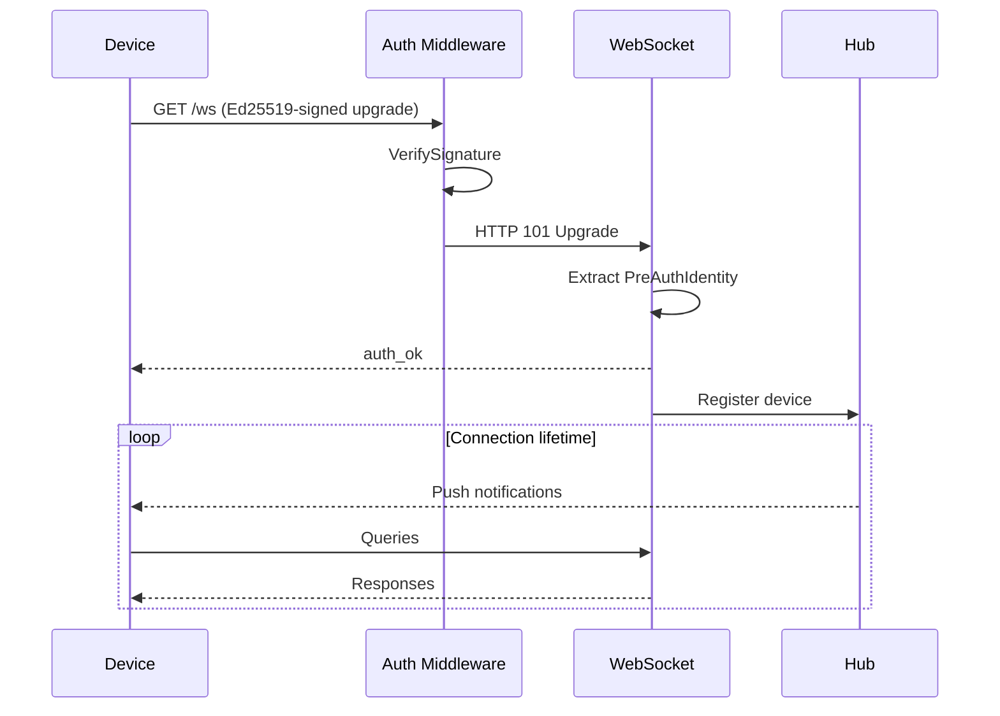

---

## 15. Full Request Lifecycle

**Use case:** Every request passes through the same middleware chain in order: CORS, body limit, rate limit, authentication, authorization, then the handler with persona tier checks and gatekeeper intent evaluation.

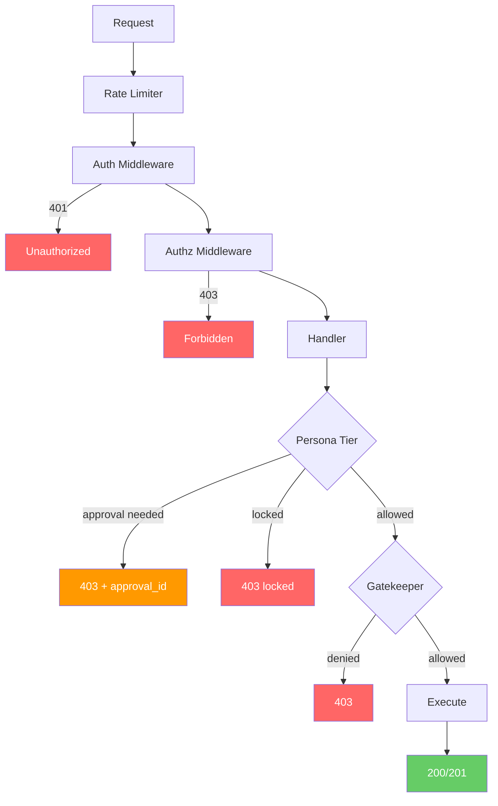
