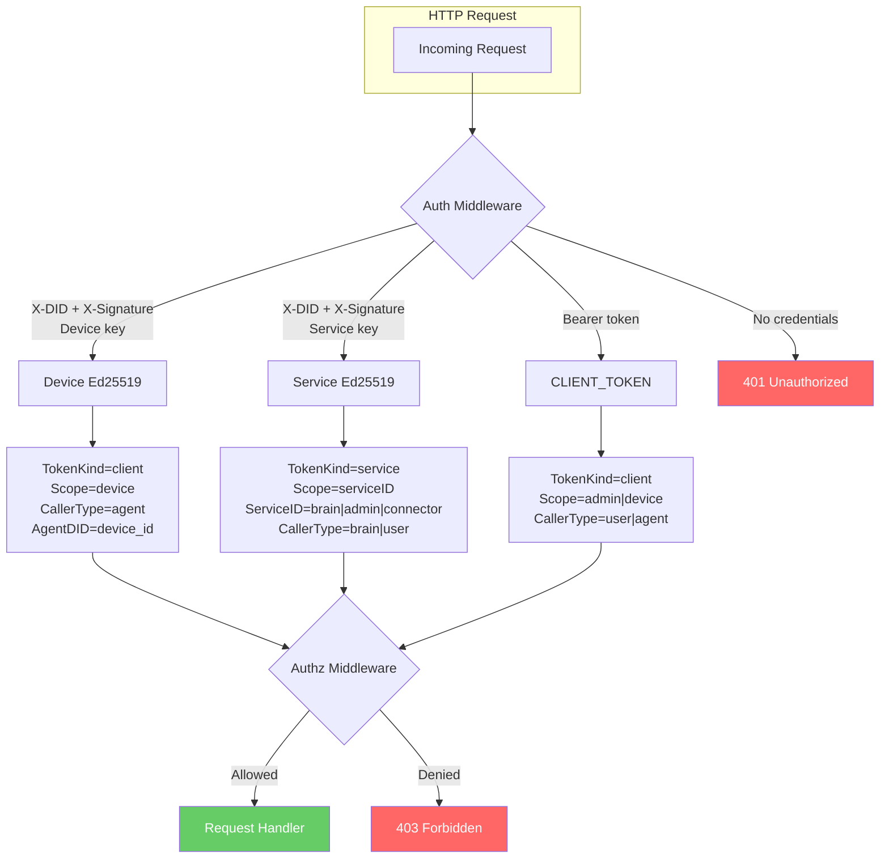
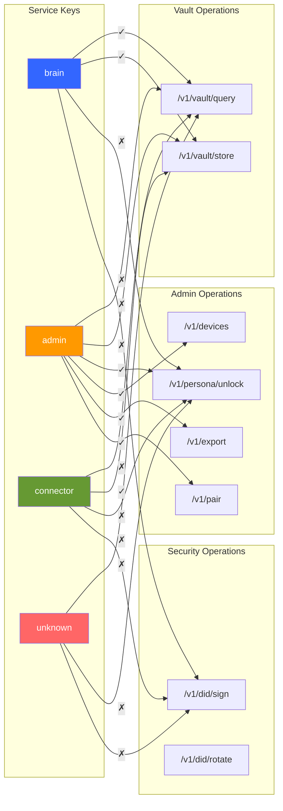
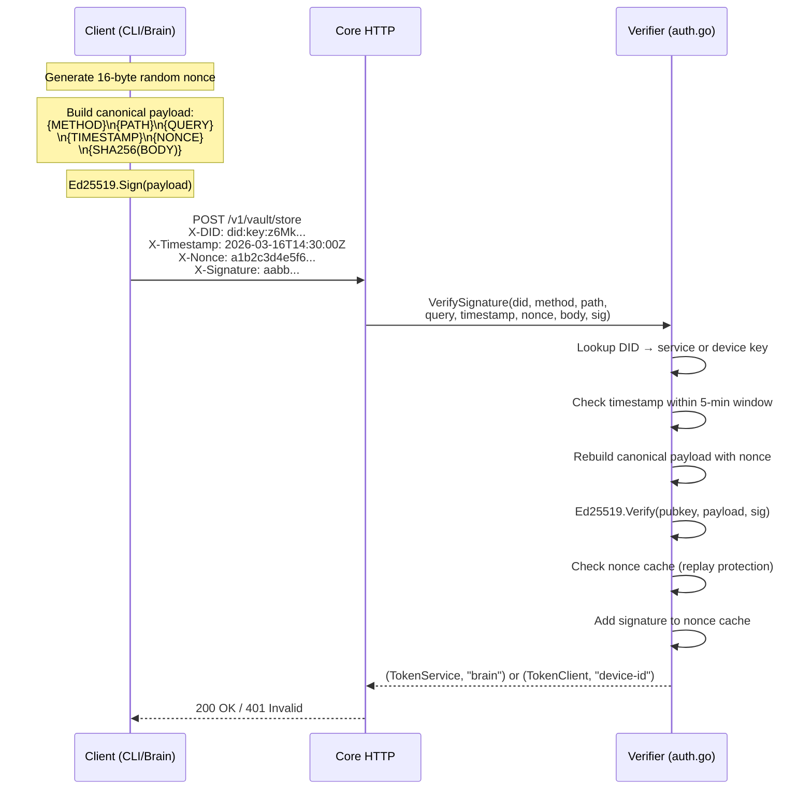
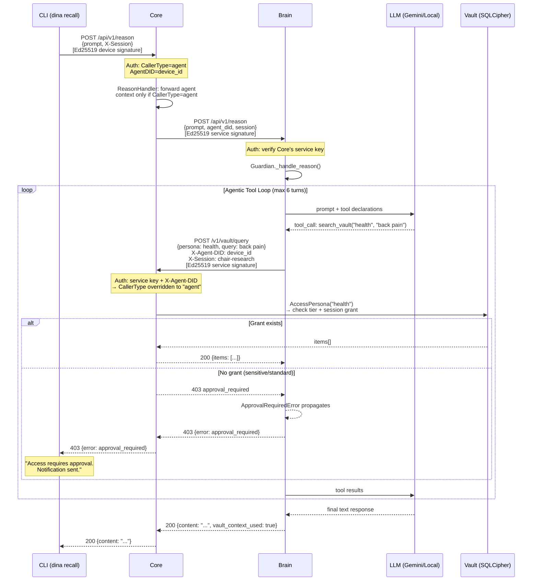
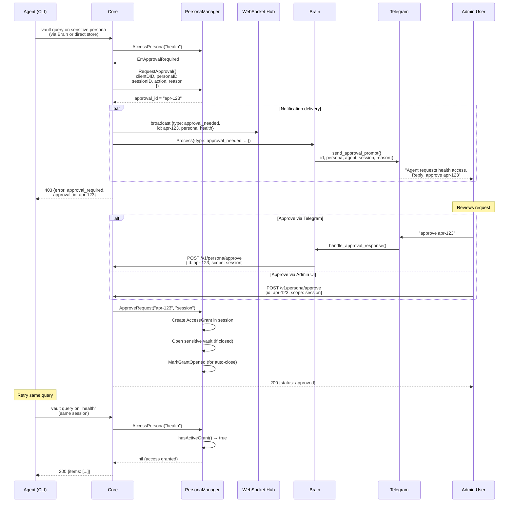
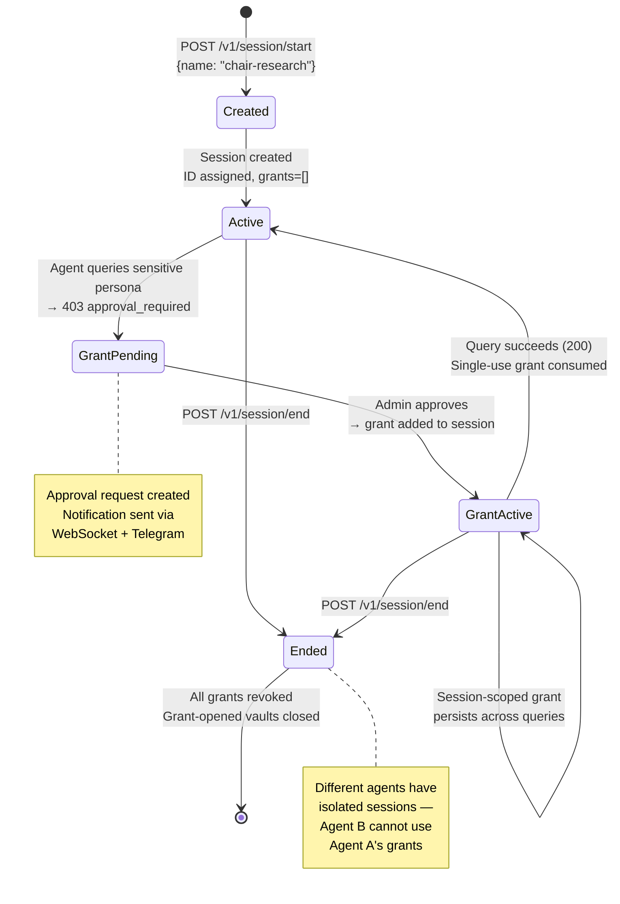
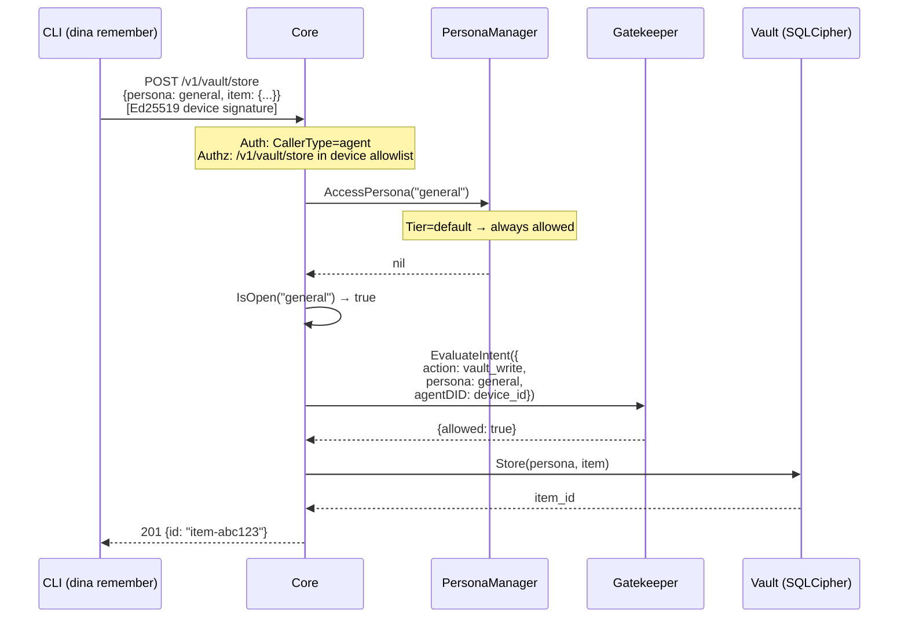
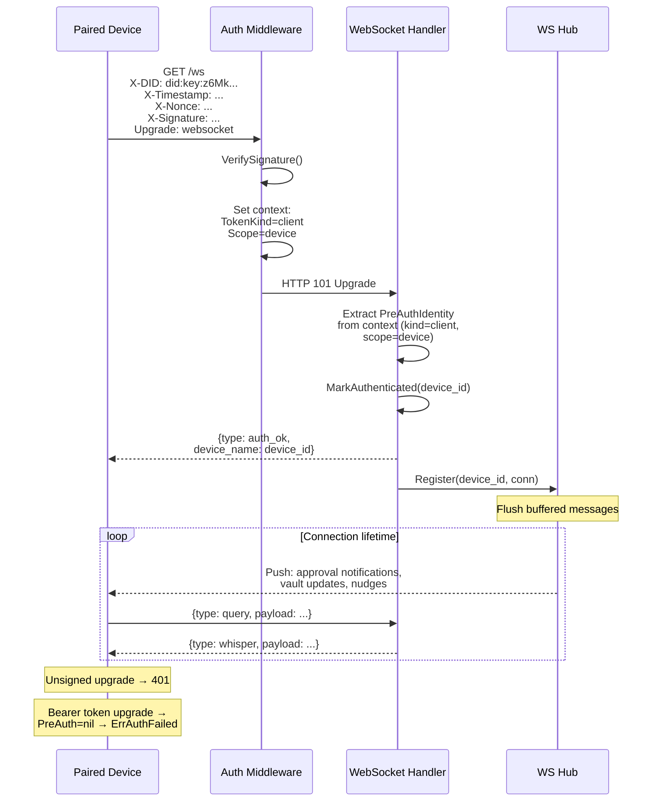
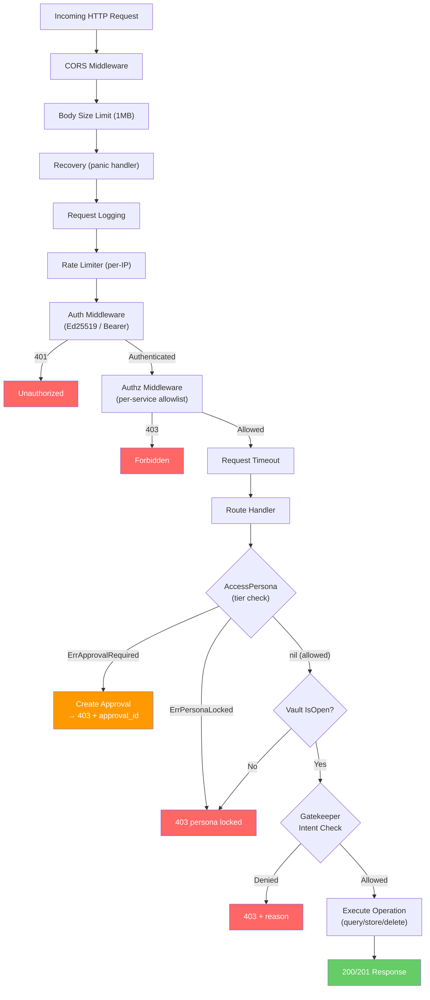

# Dina Flow Diagrams

Architecture flow diagrams for every security-relevant path. All diagrams are Mermaid — they render natively on GitHub.

---

## 1. Authentication Paths

Three authentication methods, each producing different context for downstream authorization.



---

## 2. Per-Service Authorization (Least Privilege)

Each service identity gets its own endpoint allowlist. Unknown services are denied on all paths.



---

## 3. Signing Protocol (6-Part Canonical Payload)

Every Ed25519-signed request uses this format. The nonce prevents same-second replay collisions.



---

## 4. Agent Reasoning Flow (dina recall)

The full path from CLI to vault, through Brain's LLM reasoning loop. Agents are persona-blind — Brain decides which personas to search.



---

## 5. Approval Lifecycle

From initial denial through user approval to successful retry.



---

## 6. Persona Tier Enforcement Matrix

How each tier responds to each caller type.

```mermaid
flowchart TB
    subgraph "Caller Types"
        USER["User (admin)"]
        BRAIN_C["Brain"]
        AGENT["Agent (device)"]
    end

    subgraph "Default Tier"
        D_U["✓ Always open"]
        D_B["✓ Always open"]
        D_A["✓ Always open"]
    end

    subgraph "Standard Tier"
        S_U["✓ Auto-approved"]
        S_B["✓ Auto-approved"]
        S_A["❌ Needs session grant"]
    end

    subgraph "Sensitive Tier"
        SE_U["✓ With confirmation"]
        SE_B["❌ Needs grant"]
        SE_A["❌ Needs grant + approval"]
    end

    subgraph "Locked Tier"
        L_U["✓ Passphrase required"]
        L_B["❌ Always denied"]
        L_A["❌ Always denied"]
    end

    USER --> D_U
    USER --> S_U
    USER --> SE_U
    USER --> L_U

    BRAIN_C --> D_B
    BRAIN_C --> S_B
    BRAIN_C --> SE_B
    BRAIN_C --> L_B

    AGENT --> D_A
    AGENT --> S_A
    AGENT --> SE_A
    AGENT --> L_A

    style D_U fill:#6c6,color:#fff
    style D_B fill:#6c6,color:#fff
    style D_A fill:#6c6,color:#fff
    style S_U fill:#6c6,color:#fff
    style S_B fill:#6c6,color:#fff
    style S_A fill:#f90,color:#fff
    style SE_U fill:#6c6,color:#fff
    style SE_B fill:#f90,color:#fff
    style SE_A fill:#f66,color:#fff
    style L_U fill:#fc0,color:#000
    style L_B fill:#f66,color:#fff
    style L_A fill:#f66,color:#fff
```



---

## 7. Agent Session Lifecycle

Sessions scope access grants. All grants revoked when the session ends.



---

## 8. Vault Write Path (dina remember)

Direct write to default-tier persona — the intentional exception to "agents go through Brain."



---

## 9. Admin UI Authentication Flow

Browser authenticates via passphrase, Brain proxies to Core with CLIENT_TOKEN.

```mermaid
sequenceDiagram
    participant BR as Browser
    participant CORE as Core
    participant BRAIN as Brain Admin UI

    BR->>CORE: GET /admin/
    Note over CORE: /admin/* bypasses auth,<br/>reverse-proxies to Brain

    CORE->>BRAIN: GET /admin/
    BRAIN-->>BR: Login page

    BR->>BRAIN: POST /admin/login<br/>{passphrase: "..."}
    BRAIN->>BRAIN: Verify passphrase (Argon2id)
    BRAIN-->>BR: Set-Cookie: dina_session=<id><br/>HttpOnly; SameSite=Strict

    BR->>BRAIN: GET /admin/dashboard<br/>Cookie: dina_session=<id>

    Note over BRAIN: Session valid → render dashboard

    BRAIN->>CORE: GET /v1/persona/approvals<br/>Authorization: Bearer <CLIENT_TOKEN>

    Note over CORE: Bearer auth → CallerType=user<br/>Full admin access

    CORE-->>BRAIN: {approvals: [...]}
    BRAIN-->>BR: Dashboard with pending approvals
```

---

## 10. WebSocket Authentication (Ed25519-only)

WebSocket upgrade must be Ed25519-signed. No token handshake — auth happens at the HTTP layer.



---

## 11. Full Request Lifecycle (End-to-End)

Every request passes through these checkpoints in order.


