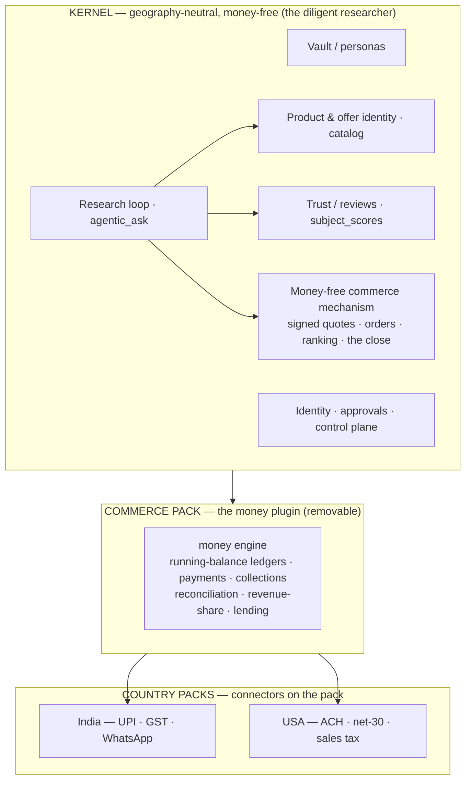
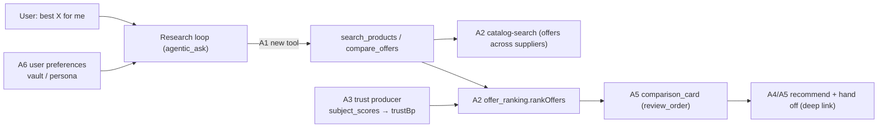

# Researcher Kernel — Architecture & Pending-Work Plan

**Status:** BUILT through Groups A–C and D1/D2/D3/D5, including the owner-side dispatch producer, A6 against the real model (Iter 30) and the §5.D rail data model + all three khata → rail hooks (Iters 32–38). D3's language half is CLOSED by the owner's decision of 2026-09-15 — English only, no voice (the §11 context projector, the §15.6 card-template render and D4's in-repo half are BUILT as of 2026-09-15, Iters 40-42; B1's couplings are down to two, enumerated and test-enforced, Iter 43; open: the operator runners, the feed agreements themselves, B1's package move, a device run of the phone verifier) · **State claims re-checked against the code 2026-09-13** (the §4 table is the 2026-08-30 baseline the plan was written against; the banner above it carries the current state)
**Scope:** defines what belongs in the kernel versus a plugin, confirms the product/offer model as built, and specifies the pending work to make the base vision — the diligent researcher — run end to end for a consumer.
**Companions:** `docs/COMMERCE_PROCUREMENT_PLUGIN_ARCHITECTURE.md`, `docs/COMMERCE_PLUGIN_DECISION_MEMO.md`, `docs/PLUGIN_ARCHITECTURE.md`.

---

## 0. TL;DR

- Dina's base vision is **the diligent researcher, loyal to you alone**: an agent that finds the best item across suppliers, ranks by verified truth, recommends, and hands off — without touching money.
- The single line that sorts every capability into **kernel** or **plugin** is **money**. Present & query (kernel), coordinate & close without money (kernel), run the money (plugin).
- The **product/offer model already exists and is strong** — identifier-first, with reviews on the product and trust on the seller. Keep it in the kernel.
- The **consumer research loop is NOT wired end to end**, though nearly every component exists and is tested. The engines are reachable only from the seller/buyer photo-order path and owner routes. The agentic loop cannot reach the product catalog at all, and there is no consumer screen.
- **Plan, in order:** (A) wire the consumer research loop — mostly wiring, one new tool, one screen, one trust producer; (B) extract the money engine to a Commerce Pack plugin; (C) finish the plugin substrate (repo-proof verifier + install UI); (D) country packs (India, USA).

---

## 1. The founding principle and the money line

Marketing works on a buyer who acts on a whim. For the diligent buyer — one who reads the reviews, learns the technology, and knows their own preferences — a brand can only support at the edges. An AI agent is the perfect diligent researcher: it reads everything, stays objective, and works for one master. That is the kernel.

The founding law draws the boundary: **Cart Handover — Dina advises, hands you to the cart, and never touches money.** The line is *money*, not *action*. An agent's value over a search engine is that it can act for you — book a slot, agree a quantity, send an order — so the kernel is allowed to act, up to the point money moves.

Sort every capability by one test: **does it touch or manage money?**

| Tier | Capability | Money? | Home |
|------|-----------|--------|------|
| 1 | Present & query — catalogs, listings, live price/availability | No | **Kernel** |
| 2 | Coordinate & close — book, agree, send an order the seller confirms | No | **Kernel** |
| 3 | Run the money — khata ledger, payments, collections, revenue share, reconciliation, lending | Yes | **Plugin** |

The consumer "find the best item across suppliers" flow needs only Tier 1 plus trust plus the research loop. It needs no plugin.

---

## 2. The layered architecture

- **Kernel (geography-neutral, money-free):** vault, identity, approvals, the control plane, product/offer identity and catalog, trust, the research loop, the close, **and the money-free commerce mechanism — signed quotes, orders, ranking, comparison.** The base vision runs entirely here and ships in every country unchanged. This is the single home for signed quotes and orders — §1, §5.B1, and §8 all agree: kernel.
- **The shared wire protocol (`packages/commerce-protocol`, zero-dep):** the byte-exact quote / order / catalog / document types the kernel mechanism and the money pack both speak — a protocol, not a separate runtime layer.
- **Commerce Pack — the money plugin (removable):** the money engine — running-balance ledgers, payments, collections, reconciliation, revenue-share, and lending. The only part the money line moves out of the kernel.
- **Country packs (specific):** India (UPI, GST, WhatsApp) and, later, USA (ACH, net-30, sales tax) — connectors over the shared protocol and the money pack, not forks.
- **Thin geography layer (config/adapters, not the money pack):** language + PII patterns in the Brain, review-source ingesters and per-market trust bootstrap in PeerLens/AppView, and the notification channel in transport.

**Guard:** the product/offer identity and catalog currently live under the `packages/commerce-protocol` namespace, but by the money line they are **kernel** (present & query). Do not move them into the money plugin during the extraction (see §5.B2).

---

## 3. The product/offer model (as built)

A catalog product is two things stacked: **what you research** (the product) and **who you buy it from** (the offer). Both already exist, identifier-first.

- **Product identity — `ProductRef`** (`packages/commerce-protocol/src/product.ts`): identifier-first, issuer-bound. `scheme: 'gtin' | 'manufacturer_sku' | 'dina_subject' | 'custom'`, plus `value`, `issuer_did`, `variant_digest`. Header rule: *"Names are labels, never identity."* The same `ProductRef` is the line-item identity in `CatalogItem`, `QuoteRequestLine`, and `PurchaseOrderLine`.
- **Offer — `CatalogItem`** (`packages/commerce-protocol/src/catalog.ts`): one supplier's listing — a `ProductRef` plus `supplier_did` and price. Many offers, one product. The AppView projection keys each row on the identifier, never the name (`appview/src/shared/commerce/catalog-projection.ts`): *"same GTIN under two names is one product; 'Oak dining chair' from two suppliers is two products."*
- **Canonical reviewed entity — PeerLens `subject`** (`appview/src/db/schema/subjects.ts`, handler `subject.ts`): the shared entity that reviews aggregate onto through `subject_scores`, independent of any seller. Entity resolution runs in tiers (`appview/src/db/queries/subjects.ts` — `resolveOrCreateSubject`): a global identifier first (GTIN/ASIN/QID/DID/URL), then a normalized name, then a `canonical_subject_id` pointer the read path follows. **Caveat (verified):** identifier-based resolution and cross-seller de-duplication *by identifier* are built and work, but **claim-driven merging is not implemented** — `subject-claim` records (same-entity/related/part-of) are ingested and stored (`subject-claim.ts`), yet no writer derives `canonical_subject_id` from them. So a same-entity claim is a stored-but-unprocessed input today, not an active merge.
- **Seller as a relation, not the product — `ProductRelationshipClaim`** (`catalog.ts`): `manufactured_by`, `marketed_under`, `variant_of`, `sold_by`, etc. The seller attaches to a product through `sold_by` (object = DID).
- **Two trust dimensions, kept apart:** product reviews aggregate on the `subject`; seller trust is the operator DID plus the `services` surface. GTIN is first-class (8–14 digits, CSV-importable). A manufacturer part number is refused as a direct CSV import *scheme* (`catalog_import.ts`), yet it still reaches identity by other paths: the photo-catalog assembler encodes `mpn` as a scoped `custom` ProductRef (`catalog_assembler.ts`), and PeerLens treats barcode/ASIN/MPN as a precise SKU identifier (`subject_identifier.ts`). Reconciling MPN's treatment across these paths is an open item (§7).

This is the most vision-faithful part of the codebase. The pending work builds *on* it, not around it.

---

## 4. Current state (verified)

> **Build status, 2026-09-13** (the table below is the 2026-08-30 baseline the plan was written against; `implementation-notes.html` Iters 0–30 is the running record — Iter 21 the phone verifier, Iter 22 the country packs, Iter 24 the dispatch producer and the first khata → rail hook, Iter 26 the phone's 24-hour grant, Iter 27 §6 chat routing into plugins, Iter 30 the A6 real-model run, Iters 23 and 25 the verification rounds). Group A: **built and run against the real model** (rows 1–5 BUILT&WIRED via `search_products` → money-free comparison card → `InlineComparisonCard`; A6 — the `products` intent source, readable prices, the owner's own name for each seller on the offers, and `recommend_offer` committing the loop's preference-weighed pick to the card; evidence in `apps/home-node-lite/brain-server/__tests__/a6_preference_diligence_real_llm.test.ts`, four scenarios, 4 of 4 with the card agreeing with the prose). Group B: **built** — the decline slice carved (own store + own wire module `quote_decline.ts` sharing the `trade_digest.ts` family), the money line resolves per call from an `active` first-party Commerce Pack (`runtime.money()`), khata mail arriving while the pack is closed is spooled and replayed; the money engine itself still lives in `packages/core/src/commerce` behind that line (the in-process pack), not in a separate package. Group C: **built on both hosts** — the proof chain is one shared module (`@dina/home-node/repo_proof_chain`), the server loads the AT-Protocol libraries lazily (`@dina/net-node`), the phone bundles them statically (`@dina/net-expo/repo_proof`, Metro shims for `node:timers/promises` / `node:dns/promises` / `@atproto/common`, a `Buffer` polyfill in the app entry) and wires the verifier at boot only after an on-device self-check over a shipped fixture repo passes; `/v1/plugins/install/*`, runner pairing bound in Core, abandoned-install sweep, consent card and Plugins screen. The phone build compiles and bundles the chain (`expo export`); a run against a live PDS on a device is still owed. Group D: **D3's PII half built** (Aadhaar Verhoeff + PAN holder-type checks in both tiers); **D1 / D2 / D5 built as first-party country packs** (`packages/core/src/commerce/country_packs.ts`, installable from the Plugins screen and `POST /v1/plugins/install/country_pack`) — the contracts, the consent, the owner-side dispatch producer (`plugins/invoke.ts`, `POST /v1/plugins/invoke`, the approval-inbox card) and the first hook (an accepted UPI/transfer PaymentNote asks the pack's status rail, `commerce/country_rails.ts`); a settled payment still needs the operator's runner behind the pack; D4 remains open; D3's language half is closed by decision — English only, no voice (§5.D).

Legend: **BUILT&WIRED** end to end · **PARTIAL** (engine/data exists, no consumer caller) · **ABSENT**.

| # | Capability | Verdict | Evidence |
|---|-----------|---------|----------|
| 1 | Product-catalog tool in the agentic loop | **ABSENT** | Tool set in `packages/brain/src/composition/agentic_ask.ts` reaches vault, PeerLens, and provider *services*; no tool reads `CatalogItem`/`commerce_catalog_products`/`ProductRef`. |
| 2 | Cross-supplier product search & ranking | **PARTIAL** | Recall: `appview/src/shared/commerce/catalog-search.ts` + xrpc `commerce-catalog-search.ts`. Buyer rank: `packages/core/src/commerce/offer_ranking.ts` (`rankOffers`), `procurement_service.ts`, owner routes `/v1/commerce/procurement/{plan,choose}`. `procurement_service.ts` docstring notes these were orphans with no production caller. |
| 3 | Trust into product/offer ranking | **PARTIAL** | `offer_ranking` weights `trustBp` at 15% (`WEIGHTS.trust = 1500`), but `/choose` takes `offers` with `trustBp` **already supplied by the caller** — no producer maps `subject_scores` in. Catalog search uses trust only as a floor (`belowCommerceTrustFloor`). Vault search re-rank is *sender*-trust, not product reviews. |
| 4 | Consumer search/compare screen | **ABSENT** | All `apps/mobile/app/` commerce screens are the D2D photo-order flow (`catalog(-draft).tsx`, `orders.tsx`, `order-draft.tsx`, `trade.tsx`). No "search → compare offers → recommendation" screen. |
| 5 | Recommend + cart handover for an individual | **PARTIAL** | `packages/core/src/commerce/comparison_card.ts` builds the `commerce_comparison` card — `primaryAction` hard-coded `review_order`, never `buy` — but only inside the owner-only `/v1/commerce/procurement/choose` route. No consumer recommend/handoff surface. |
| 6a | Money/commerce engine location | **IN CORE** | Full engine (~120 files) in `packages/core/src/commerce`. Not extracted to a plugin. |
| 6b | Plugin substrate | **PARTIAL (P0)** | Substrate + first-party install wired (`packages/core/src/plugins/install_service.ts`, `apps/mobile/src/services/commerce_install.ts` in `orders.tsx`). Repo-proof verifier wired only in tests (`setRepoProofVerifier` — install fails closed on null, `install_service.ts:216`). No third-party marketplace/consent/uninstall UI. |

**The shape of the gap:** the pieces exist; they are wired to the wrong caller. The consumer research path is missing a tool, a producer, and a screen. The exact root cause for each line is given under its item in §5 (**Why it's missing**).

---

## 5. Pending work — detailed

### 5.A The base-vision research loop (priority)

#### A1 — Product-search tool in the agentic loop  ·  *To build*
- **Why it's missing:** the loop's tool set was assembled for vault and *service* discovery. The product catalog was built for the D2D commerce/procurement path, and no Brain-side tool was ever written to bridge the loop to it — the loop has no import or factory that touches `CatalogItem` / `commerce_catalog_products`. The gap is a missing bridge, not a missing engine.
- **Where:** a new tool factory beside `packages/brain/src/reasoning/service_tools.ts`, registered in the tool set in `packages/brain/src/composition/agentic_ask.ts` (the block currently registering `search_provider_services`, `query_service`, etc.).
- **Tool(s):** `search_products` (resolve a product + return offers across suppliers) and/or `compare_offers` (given a `ProductRef`, return ranked offers). Name and shape to match the existing tool conventions.
- **Calls:** the cross-supplier search + ranking of A2. Input: a natural-language item query or a resolved `ProductRef`; output: ranked offers with per-supplier price, trust, and the incomparable factors.
- **Intent routing:** extend the intent classifier so product/price/"which is best"/compare intents route to the new tool (today they have nowhere to go — the loop only knows *services*, not products). **Built (Iter 30):** a `products` intent source beside `peerlens`, named in the ask prompt's source legend and tool map; the real-model run showed the prompt, not the tool description, decides what the loop calls.
- **Acceptance:** an `ask` like "best <product> for me" reaches the tool, returns offers from more than one supplier, and the loop can reason over them.

#### A2 — Give the cross-supplier search & ranking a consumer caller  ·  *Partial → wire*
- **Why it's partial:** the search and ranking engines were built for the RFQ/buyer-procurement flow. Their intended callers — the consumer mobile screens and AppView-backed discovery — were never built, so `procurement_service`'s exported symbols sat as orphans (its own docstring says exactly this) and were plumbed to an owner route as a stopgap. The engine works; it has no consumer caller.
- **Reuse, don't rebuild.** The recall path (`catalog-search.ts` + `commerce-catalog-search.ts` xrpc) and the buyer ranking (`offer_ranking.ts` `rankOffers`, sequenced by `procurement_service.ts`) already exist. They were orphaned to an owner route.
- **Seam:** the A1 tool calls this path. Decide the call route:
  - **In-process** (Brain → Core client) for a local catalog, or
  - **AppView xrpc** (`commerce-catalog-search`) for network discovery across published catalogs.
  - Likely both: AppView for discovery of who lists the product, then `offer_ranking` for the buyer-facing rank.
- **Keep the distinction:** catalog-search is *recall* ("not the buyer's ranking"); `offer_ranking` is the buyer's rank. Don't collapse them.
- **Note:** `procurement_service` was built for the RFQ/quote path (signed quotes). For a pure research query with no money, a lighter path may read catalog prices directly rather than fanning out live RFQs. Decide per §7.

#### A3 — Feed real trust into the rank  ·  *Partial → build the producer*
- **Why it's partial:** `offer_ranking` is a pure function that takes `trustBp` as a caller-supplied input, and the producer that fetches PeerLens `subject_scores` and maps them into `trustBp` was never written. Trust was only ever used as a hard floor in catalog search (`belowCommerceTrustFloor` — "trust appears nowhere in the score"), never as a scored input in a live path. So the ranker has a trust slot with nothing feeding it.
- **Problem:** `rankOffers` expects `trustBp` (0..10000) per offer; nothing populates it from PeerLens. `/choose` receives it pre-filled by the caller.
- **Build:** a producer that, for each candidate offer, fetches `subject_scores` for (a) the **product** `subject` and (b) the **seller** DID, and maps them to `trustBp` before calling `rankOffers`.
- **Decide the weighting:** product-review trust vs seller-trust are two dimensions (§3). Either fold both into one `trustBp`, or extend the ranking to weigh them separately. Record the choice.
- **Reuse:** the `search_peerlens` tool already fetches scores as text; the producer needs the structured `subject_scores` (`packages/protocol/src/peerlens/score_v1.ts`) instead.

#### A4 — Consumer search-and-compare screen  ·  *To build*
- **Why it's missing:** the entire mobile commerce UI was built for the D2D trade use case — a seller photographs a price list, a buyer photographs an order sheet. The consumer search-and-compare surface fell outside that push and was never designed. No screen imports catalog search, `offer_ranking`, `comparison_card`, or procurement.
- **Where:** a new screen in `apps/mobile/app/`, distinct from the seller/buyer photo-order screens.
- **Flow:** enter/utter a product → see offers across suppliers, ranked, with price + trust + "what can't be compared" → open the recommendation.
- **Calls:** the A1 tool via the normal `ask` path, or a dedicated consumer route if a non-conversational surface is wanted.
- **Renders:** the comparison card from A5.

#### A5 — Surface the recommend + hand-off  ·  *Partial → surface*
- **Why it's partial:** `comparison_card` was built as a step *inside* the owner-only `/v1/commerce/procurement/choose` route — the end of the buyer's quote comparison, leading into an order draft. It was never given a standalone consumer emitter, nor the deep-link / "where to buy" hand-off action that a money-free recommendation needs. The card is right; it lives in the wrong flow.
- **Reuse:** `comparison_card.ts` already builds the base-vision handover — `primaryAction: 'review_order'`, never `buy`, ranked `alternatives`, named `incomparable` factors.
- **Build:** a consumer path that emits this card outside the owner-only `/v1/commerce/procurement/choose` route, and a **hand-off action** — a deep link / "where to buy" / credit-the-source — consistent with Cart Handover. For a consumer with no order intent, the primary action is the hand-off, not an order draft.
- **Guard:** never introduce a "buy" that moves money here; the card contract already forbids it.

#### A6 — Match offers to the user's stated preferences  ·  *BUILT and run against the real model (Iter 30)*
- **Why it was missing:** there was no product-shaped input for the loop to reason over — it depended on A1–A2. The reasoning loop itself existed; the diligence step was never built because products never reached it.
- **The heart of the vision:** the loop weighs the offers, the reviews, and the technology against *this user's* preferences.
- **Depends on** A1–A2 (there must be product-shaped input to reason over) and reads preferences from the vault/persona.
- **Built:** the weighing is the model's — no per-scenario rule — over inputs that make it possible: the planner pre-fetches the budget (finance) and seller notes (general); `search_products` hands the loop prices in major units, seller trust as a percentage, and **the owner's own record of each seller** when the supplier DID is one of their contacts (`contactLookup`: name, trust level, `preferred_for`) — offers are DID-keyed, preferences are name-keyed, this is the bridge; `recommend_offer` then **commits the decision to the card** — which offer (or none), why in the owner's terms, what was set aside — and `buildComparisonCard({choice, sellerNames})` renders it ("Chosen for", "Set aside", the passed-over ranking #1 kept as an alternative), so the card the phone posts agrees with the words. The two tools share a bounded research cache; the card scores nothing new and takes no price from the model.
- **Evidence:** `apps/home-node-lite/brain-server/__tests__/a6_preference_diligence_real_llm.test.ts` (gated: `DINA_RUN_REAL_LLM=1`; OpenRouter by default, `DINA_BRAIN_LLM_PROVIDER` overrides), four scenarios where the ranker's #1 conflicts with a stated preference — trusted-over-cheap, a budget below every offer, a sworn-off seller known only by contact name, a `preferred_for` contact — 4 of 4 on the production credits model (Iter 30), prose and card agreeing. The first run (0 of 4) found the prompt gated the loop to PeerLens and the prices reached the model as minor units; both fixed in the same iteration. The verification round (Iter 31) then hardened the harness (personas published to Brain, S1 made decisive, the owner's vault asserted read) and found two production bugs on the credits model — a 512-token planner budget a reasoning model spent thinking, and empty final turns — fixed in `SMALL_TASK_MAX_TOKENS` and the loop's one-time nudge; the intent eval routes 19/19 on OpenRouter. The hardened suite then ran 4 of 4 again — with the planner fetching from the owner's vault and each answer citing the owner's own statement, not a trust score.

**Group A outcome:** the base vision runs end to end for a consumer, reusing the engines that already exist. No money touched, no plugin required.

---

### 5.B Kernel / plugin split

#### B1 — Extract the money engine to the Commerce Pack  ·  *Extract (core → plugin)*
- **Why it's still in core:** the engine was built directly in core during the trade push — the fastest path was to build in core and prove it live on the node bed. The extraction is designed (`COMMERCE_PLUGIN_DECISION_MEMO`) but never executed: the substrate to host it isn't fully wired (C), and nothing forced the move until the money-line boundary was settled.
- **What moves:** the money machinery in `packages/core/src/commerce` — `trade_ledger`'s money documents (delivery / payment / ledger; its money-free quote-decline slice is **retained**, per the split below), `trade_ledger_service` (khata authoring + the `trade_fold` derived balance), `dues`, `revshare_ledger` / `revenue_share`, and payments / collections / lending — into a Commerce Pack plugin. The money-free quote, order, and catalog machinery does **not** move by the money line (see the boundary note). **Name trap, verified in code:** `reconciliation_service.ts` (`CommerceReconciliationService`) does **not** move — despite its name it is the money-**free** order close (the signed status chain, the cancellation race, and the §16.2 restore fence; `reconciliation_service.ts:24-25`), wired as the `lifecycle` engine at `runtime.ts:83`, not a money ledger. The money reconciliation is the khata fold (`trade_fold` / `dues`), which does move.
- **What stays in Core (kernel):** identity, approvals, signing, D2D, the vault — **and the money-free research components** `offer_ranking`, `procurement_service` (fan-out / filter / rank / evidence; it touches no money — its own docstring states it "does not send anything" and "adds no rule of its own"), `comparison_card`, `product_evidence`, and `quote_fanout`. The consumer research loop (§5.A2) reuses these, and §5.B2's test requires them to keep working with the money plugin uninstalled — so they must **not** move.
- **Boundary note — the money line supersedes the decision memo here.** `docs/COMMERCE_PLUGIN_DECISION_MEMO.md` (2026-08-06, a *proposed* decision predating this reframe) drew a broader line: it packaged discovery, catalogs, quotes, comparison, and orders into the Buyer/Supplier plugins, leaving Core only generic primitives (identity, authz, approvals, signing, D2D). **This document's money line is authoritative and narrower** — the money-free research / quote / order / catalog machinery stays in the **kernel** (the base vision); only the money moves. The memo's broader boundary is superseded on this point and needs updating to match (§7.7) — a follow-up doc edit, not an open design fork. This is why §5.A/§5.B keep the research/quote/order machinery kernel-side.
- **Module + runtime + repository split (this is a refactor, not a file move — three couplings must be cut first):**
    1. **Direct imports:** `buyer_response.ts:61` imports the money-free `verifyInboundQuoteDecline`, and `tender.ts:42` imports `rehydrateTradeDocument`, both from `trade_ledger`.
    2. **Transitive runtime:** `tender.ts`/`buyer_response.ts` call `getCommerceRuntime()` (`runtime.ts`), which *statically* imports the moving `revshare_ledger` (`:87`) and `trade_ledger` (`:98`, `:105`) and constructs the money ledger unconditionally (`runtime.ts:448`). (It also imports the money-free `reconciliation_service` at `:83`, wired as the order-close `lifecycle` — that one stays.)
    3. **Mixed persistence:** `trade_ledger` is one module with one repository. `rehydrateTradeDocument` (`:116`) and `TradeDocumentKind` (`:77`) span `quote_decline` (money-free) *and* `delivery_note` / `payment_*` (money), and the single `SQLiteTradeDocumentRepository` (`:175`) stores every kind. Moving that repository leaves the kernel decline path with no store; keeping it leaves the money delivery/payment store in the kernel.
   **The split:** carve a money-free quote-decline slice out of `trade_ledger` — `verifyInboundQuoteDecline`, a decline-only kind/row contract, and a concrete kernel store exposing the operations its callers actually use: `put(row)`, `answersTo(recordDigest, 'quote_decline')`, and a **row-level** decline rehydrate that preserves the stored-row `recordDigest` cross-check `rehydrateTradeDocument` performs today (`trade_ledger.ts:129`) — the JSON-level `rehydrateQuoteDecline` validates the payload but omits that check, so wrap it, don't call it bare. Surface the store as a `declineDocuments` field on an always-present money-free commerce runtime, kept kernel-side. Move the delivery / payment / ledger / revenue-share kinds and the khata fold (`trade_ledger_service` / `trade_fold` / `dues`), their repository surface, and implementations behind a `money` adapter that `getCommerceRuntime` resolves from an **`active`** Commerce Pack install (the plugin registry's `PluginInstallStatus`); when the pack is absent, `paused`, or `revoked`, money-only capabilities return a typed `unavailable`, while the kernel `declineDocuments` store keeps serving the money-free path.
   **Acceptance (the B1 decline round-trip test — distinct from §5.B2's catalog-search test):** with **no** money plugin installed, the `tender` and `buyer_response` quote/decline flows must **persist a decline, reload it, and compare it** — a real store round-trip, not a compile against an in-memory stub — and a stored decline row whose digest does not match its `recordDigest` must be **rejected**.
- **Sequencing:** do this *after* Group A so the consumer path is proven against the current layout first, then extracted cleanly.
- **State, 2026-09-15 (Iter 43).** The three couplings this section named are down to two, and the graph is now asserted over the source by `packages/core/__tests__/commerce/money_boundary.test.ts`, which enumerates the eleven money modules (the extraction manifest), proves the thirteen money-free research/catalog/close modules import none of them (§5.B2's guard, made static), and lists what remains with what each costs — failing both on a new coupling and on a stale entry. **Cut:** `d2d/receive_pipeline.ts` no longer imports `commerce/trade_ingress`; it asks `d2d/trade_ingress_seam.ts`, which the money engine registers into at `installCommerceRuntime`. **Remaining:** `commerce/runtime.ts` constructs the money stores (they become injected), and the money routes share `server/routes/commerce.ts` with the money-free ones (carve `/v1/commerce/trade/*` and the revenue-share routes into their own registrar). Neither is a cut on its own — each only pays off as part of creating the package and re-pointing the two composition roots and the phone.

#### B2 — Keep the catalog in the kernel  ·  *Hold (guard)*
- **Why it needs guarding:** the catalog is physically namespaced under `commerce-protocol`, so a careless extraction could sweep it into the money plugin by association. It must stay in the kernel — a consumer search has to work with the money plugin uninstalled.
- The catalog/product identity sits in the `commerce-protocol` namespace, but it is **present & query** — kernel.
- During the B1 extraction, do **not** pull `product.ts`, `catalog.ts`, the catalog projection, or the search into the money plugin. If helpful, reorganize so a product/catalog module is visibly separate from the money module.
- **Test of correctness:** a consumer must be able to search offers across suppliers with the money plugin *uninstalled*.

---

### 5.C Plugin substrate (P0)

#### C1 — Wire the repo-proof verifier in production  ·  *BUILT on both hosts (2026-09-13; phone bundle-proven, device run owed)*
- **Built:** one shared chain, `packages/home-node/src/repo_proof_chain.ts` (`createRepoProofChain`, reached by the CJS-safe subpath `@dina/home-node/repo_proof_chain`); the server shell `packages/net-node/src/repo_proof_verifier.ts` loads `@atproto/*` lazily via `import()` (a rejected load is retried, a settled one memoized); the phone shell `packages/net-expo/src/repo_proof_verifier.ts` imports them statically for Metro, with shims for `node:timers/promises`, `node:dns/promises` (fails closed) and `@atproto/common`, and a guarded `Buffer` polyfill in the app's own entry (`apps/mobile/src/polyfills.ts`). The phone wires the verifier only after a **self-check** (`selfCheckRepoProofChain`, `packages/home-node/src/repo_proof_selfcheck.ts`) has run the whole chain on the device over a fixture repo the package ships; a host that fails keeps its door closed and names the fault. Both boots inject through `setRepoProofVerifier`. The paragraphs below record why it was missing.
- **Why it was missing:** only the contract *shape* of the verifier exists in protocol (`RepoProofVerifier` is an injected callback), and the real implementation — which needs network access and CAR decoding — was never written. The first-party install path (`reference_install.ts`) uses a `local_publisher_key` trust anchor and bypasses repo-proof by design, so a working first-party path removed the pressure to build it.
- At the time, `setRepoProofVerifier(...)` was called only in tests; `install_service.ts` fails closed when the verifier is null and *invokes the injected* `RepoProofVerifier` callback (`packages/protocol/src/plugins/verifier.ts`) rather than fetching anything itself — the seam the build then filled from both boots.
- **Build (sidecar-safe):** implement the verifier in a **network-capable adapter** (e.g. `net-node` / the server composition root) that does the fetch, CAR-decode, and proof verification, and inject it via `setRepoProofVerifier` at boot. Core's pure domain must **not** call external APIs (the CLAUDE.md sidecar invariant — "Core never calls external APIs"); it invokes the injected callback and enforces the install decision deterministically. The injection seam already exists — only the adapter and its boot wiring are missing.

#### C2 — General install / consent / uninstall UI  ·  *BUILT on both hosts (2026-09-12)*
- **Built:** server routes `/v1/plugins/install/{begin,country_pack,setup_code,confirm,decline,uninstall}` (`packages/core/src/server/routes/plugin_install.ts`), the phone's ceremony service (`apps/mobile/src/services/plugin_install.ts`), `PluginConsentCard`, and Settings → Plugins (`apps/mobile/app/plugins.tsx`); runner pairing bound inside Core (`completePairing`, PLUGIN_ARCHITECTURE §15.3); one teardown path (decline / uninstall / abandoned-install sweep) that revokes the runner device. The paragraphs below record why it was missing.
- **Why it was missing:** only a first-party Commerce Pack has ever needed installing, so its ceremony was built commerce-specifically. No third-party plugin exists yet, and the general marketplace UI depends on the verifier (C1) — so the general screens were never forced.
- At the time only the first-party Commerce-Pack ceremony existed (`commerce_install.ts` in `orders.tsx`), and general install/consent/uninstall was exposed only through commerce-specific routes (`/v1/commerce/install/{plan,begin,bind_device,confirm,retire}`).
- **Build:** general plugin routes + mobile screens for install, the consent summary, and uninstall — the marketplace path — reusing `install_service.ts` (`confirmConsent`, `uninstall`).

---

### 5.D Country packs

| # | Item | State | Notes |
|---|------|-------|-------|
| D1 | India small-commerce plugin | Pack + producer + first hook BUILT (2026-09-13); operator runner open | `com.dinakernel.country.in` (`packages/core/src/commerce/country_packs.ts`): UPI payment status (read, regulated), GSTIN validate (read), e-way bill (write, regulated), WhatsApp reminder (write); every rail declares its `data_scope`. Installs through the first-party door (`beginFirstPartyInstall`, `local_publisher_key`) from the Plugins screen or `POST /v1/plugins/install/country_pack {pack:'in'}`, then the standard runner pairing + consent. Invoked through the dispatch producer (`plugins/invoke.ts`; `POST /v1/plugins/invoke`): one task on the plugin lane, `pending_approval` until the owner approves on the phone's inbox card, then claimed by the paired runner and validated against the pinned schema. First hook: an accepted UPI PaymentNote with an `external_ref` asks `upi-payment-status` (`commerce/country_rails.ts`); the answer lands on the task, correlated to the note — the owner still acks. The runner holding the provider account is the operator's process outside this repo. |
| D2 | USA SMB-commerce plugin | Pack + producer + first hook BUILT (2026-09-13); operator runner open | `com.dinakernel.country.us`: ACH/card settlement status (read, regulated), sales-tax rate (read), invoice with net terms (write), SMS/email notice (write). Same door, same ceremony, same producer; the hook asks `settlement-status` for an accepted `transfer` note. |
| D3 | Language + PII packs | PII half BUILT (2026-09-13); language half CLOSED by owner decision (2026-09-15): English only, no voice — nothing to build | PII: Aadhaar (Verhoeff check digit, 2–9 lead) and PAN (holder-type fourth letter) are checksum-honest in both tiers (`packages/core/src/pii/checksums.ts`, shared by Brain's Tier 2); SSN already present. Language: the owner decided 2026-09-15 — **English only, no voice**. Nothing to build: Dina already answers in English and the phone's surfaces are English. The PeerLens "languages" screen is a REVIEW-FILTERING preference (which languages of reviews to surface), not app localisation, and stays as it is. Re-open this row only if a market demands another language. |
| D4 | Review feeds + per-market trust bootstrap | In-repo half BUILT (2026-09-15); feed agreements open | The contract, the gate and the trust rules are built (`appview/src/config/review-feeds.ts`, migration `0024`): an attestation may carry a `source` block (feed, market, https deep link), admitted only from a REGISTERED feed published by that feed's own DID. An import moves a RATING and never a TRUST RING — fixed weight (never the publisher's trust), a per-subject corpus ceiling applied by scaling, no contribution to confidence, excluded from both DID-score queries, and no PeerLens trust edge. `subjectGet` splits testimony from imports and credits each feed with a deep link, which the phone renders. The registry ships EMPTY: a feed belongs there once someone has read its terms, which is a contract decision, not code. |
| D5 | Notification-channel adapter | Rails BUILT as pack capabilities (2026-09-13) | WhatsApp reminder (India) and SMS/email notice (USA) ride inside D1/D2 as `tool` + `write` capabilities Dina invokes — an outward message is an effect that meets the approval gate (Silence First). Not a transport-layer adapter: the substrate's plugin-originated `notify` kind is unshipped (`NODE_SUPPORTED_FEATURES`) and a manifest declaring it is refused `needs_newer_dina`. |

**Why deferred:** none of these were built because the product focus was the India trade push, and the kernel is geography-neutral by design, so packs are deferred by intent. Even India's own connectors (UPI/GST/WhatsApp) were stubbed on the test node bed during the trade E2E rather than wired to real rails, so no production connector exists yet.

**The rail data model and the three hooks are BUILT (2026-09-14, Iters 32–37).** The gap named below — "each is a data-model or capture decision before it is a hook" — is closed. Per the owner's decision ("Settings + contacts"): the node's own business identity (legal name, registrations, address) is a third commerce-settings kind `business`; a counterparty's is on their contact row (migration v44) and their phone / e-mail in the people graph's identity slot; one definition validates both ends (`commerce/trade_identity.ts`, with a GSTIN checksum in `pii/checksums.ts`), and the phone captures all of it on a **Trade details** screen reached from a contact. The hooks: a supplier-authored DeliveryNote asks the active pack for its filing (India `eway-bill` with both GSTINs and the dispatch priced against the bound quote; USA `invoice-terms` with the order's net days), and an overdue statement row gives the owner a **Remind** button (`POST /v1/commerce/trade/remind` → India `whatsapp-reminder` / USA `notice`, to the channel on their contact). Every one of them cards. What is still owed is the operator's runner behind each rail — the credential this repo must never hold.

**What remains, and who holds it (2026-09-13):** the packs pin the contracts, the producer dispatches them, and the first hook fires. A settled UPI payment now needs one thing this repo cannot hold: the **operator's runner** for each rail — a `dina-plugin`-style process holding the provider account (D1: a UPI payment-status source, a GSTIN / e-way bill API account, a WhatsApp Business account; D2: an ACH/card processor and a sales-tax source). Each is an owner decision plus a credential this repo must never hold; the runner lives outside the repo like the gitignored quote runner. Not yet built, and what each needs first: the remaining **khata hooks** need data the kernel does not hold — an e-way bill needs both parties' GSTINs (`DeliveryNote` carries none and no surface holds the business's own), an invoice the buyer's billing identity (GSTIN, legal name, address), a reminder the counterparty's phone or e-mail (the people graph has the `person_identities` slot; only DID rows are written today, so the capture path is what is missing). Due dates and net terms already exist (TRADE_FIRST §4.5 `dues()` on the bound quote's `payment_terms`), and that same section rules that overdue flagging is Solicited or Engagement, "never an interruption — Silence First applies to money reminders too": a reminder rail is therefore an owner-initiated action from the statement's overdue row, not an automatic hook, and it needs the counterparty's channel. Nothing in the trade-first design places a GSTIN. Each gap is a data-model or capture decision before it is a hook. Built (Iter 29): the rail's answer reaches the owner — the khata inbox's unacknowledged-payment row carries the check's state and the schema's enum answer (`railCheck`, metadata only), the Trade screen prints it in Dina's words, and the resolved approval card shows a completed plugin result as bounded `label: value` lines over the schema-validated fields. Built (Iter 40): the §11 context projector. An invocation names a SUBJECT (`{contactDid?, documentDigest?}`) and Core projects the facts itself through a first-party versioned table keyed by (category, action class) — so an e-way bill's envelope now carries both parties' registrations and the counterparty's billing address, and a reminder's carries which channel exists and never the number. Built (Iter 41): the §15.6 card vocabulary for results — a capability's `card` is a pinned TEMPLATE the manifest owns and the result fills through slots, rendered untrusted (blocks only; no badges, links, media or publisher-authored frame), with the `label: value` lines kept as the floor for a capability that declares none. Built: the phone's "Allow for 24 hours" affordance (Iter 26, driven by Core's `grant_can_silence`), and §6 chat routing — `/ask` can list and invoke installed capabilities through `GET /v1/plugins/tool-capabilities` and `POST /v1/plugins/tool-invoke`, gated by the same producer (Iter 27). D4's remaining half — the feed AGREEMENTS themselves: which review sources will let Dina show their reviews with attribution. The contract, the gate, the trust rules and the credit are built (Iter 42); registering a feed is reading its terms and deciding. D3's language half — a product decision on the first languages and the voice pipeline.

---

## 6. Sequence and milestones

1. **Wire the base-vision research loop (Group A).** The product tool (A1), the consumer caller for search+rank (A2), the trust producer (A3), the screen (A4), the recommend/hand-off (A5), preference matching (A6). Mostly wiring; turns built components into the base vision. **This is the milestone that matters.**
2. **Extract the money engine to the Commerce Pack (B).** Draw the plugin boundary; keep the catalog in the kernel; seal the finops-adjacent code inside one removable box.
3. **Finish the plugin substrate (C).** Repo-proof verifier in production, then the general install/consent/uninstall UI.
4. **Country packs (D).** India first (engine exists, add connectors); USA when the researcher goes to that market.

---

## 7. Open questions / decisions

1. **Live RFQ vs catalog prices for research.** For a pure research query (no money), does the consumer path read published catalog prices directly, or fan out live RFQs via `procurement_service`? Live quotes are fresher; catalog reads are cheaper and money-free. Likely: catalog reads for research, RFQ only when the user chooses to close.
2. **Trust weighting.** Fold product-review trust and seller trust into one `trustBp`, or rank them as two factors? (§3, §5.A3.)
3. **Discovery source.** In-process local catalog, AppView xrpc (`commerce-catalog-search`), or both? Network discovery needs AppView; a personal/local catalog does not.
4. **Unbranded / no-GTIN products.** The consumer search must degrade gracefully where the offer is the product (local/bespoke goods, services) — the `dina_subject`/name-normalization tier, not GTIN.
5. **Consumer surface shape.** Conversational (through `ask`) only, or a dedicated non-conversational search screen too?
6. **Reuse depth of `procurement_service`.** It was built for the RFQ/signed-quote path; how much applies to a money-free research query vs a lighter read path?
7. **Align the decision memo to the money line (a follow-up, not a fork).** The boundary is decided: **the money line in this document is authoritative** — the money-free discovery / catalogs / quotes / comparison / orders stay in the kernel; only the money moves. `COMMERCE_PLUGIN_DECISION_MEMO.md` (2026-08-06) predates this and still assigns those money-free parts to Buyer/Supplier plugins, so it is superseded on that point and must be updated to match. Action: revise the memo; no design fork remains in this doc. (Owner sign-off worth getting, since it changes the memo.)

---

## 8. Key files and seams

| Area | File | Role |
|------|------|------|
| Research loop | `packages/brain/src/composition/agentic_ask.ts` | Tool registration — add the product tool here |
| Loop tools | `packages/brain/src/reasoning/service_tools.ts` | Pattern to follow for the new product tool |
| Product identity | `packages/commerce-protocol/src/product.ts` | `ProductRef` — identifier-first product identity |
| Offer | `packages/commerce-protocol/src/catalog.ts` | `CatalogItem`, `ProductRelationshipClaim` |
| Cross-supplier recall | `appview/src/shared/commerce/catalog-search.ts` · `appview/src/api/xrpc/commerce-catalog-search.ts` | Discovery match/rank + trust floor |
| Buyer ranking | `packages/core/src/commerce/offer_ranking.ts` | `rankOffers`, `trustBp` weight 15% |
| Procurement sequencing | `packages/core/src/commerce/procurement_service.ts` | Fan-out → filter → rank (owner-route only today) |
| Recommend/handoff card | `packages/core/src/commerce/comparison_card.ts` | `commerce_comparison`, action `review_order`, never `buy` |
| Trust scores | `packages/protocol/src/peerlens/score_v1.ts` · `appview` `subject_scores` | Structured product/seller trust — the A3 producer's input |
| Money engine | `packages/core/src/commerce/` — `trade_ledger` *(money documents only; quote-decline slice retained — §5.B1 split)*, `trade_ledger_service`/`trade_fold`, `dues`, `revshare_ledger`/`revenue_share`, payments/collections | Extracts to the Commerce Pack (B1). The research rows above (`offer_ranking`, `procurement_service`, `comparison_card`), the money-free quote/order/catalog machinery, and `reconciliation_service` *(the money-free order close — a name trap, verified in code)* touch no money and stay in the kernel. |
| Plugin lifecycle | `packages/core/src/plugins/install_service.ts` · `plugins/runner_pairing.ts` · `pairing/ceremony.ts` | Install/consent/activate/uninstall; runner pairing bound in Core (§15.3); abandoned-install sweep |
| Repo-proof verifier | `packages/protocol/src/plugins/verifier.ts` (contract) · `packages/home-node/src/repo_proof_chain.ts` (shared chain) · `packages/net-node/src/repo_proof_verifier.ts` (server) · `packages/net-expo/src/repo_proof_verifier.ts` (phone) | Built (C1); injected at both boots |
| General install (both hosts) | `packages/core/src/server/routes/plugin_install.ts` · `apps/mobile/src/services/plugin_install.ts` · `apps/mobile/app/plugins.tsx` | Third-party door (repo proof) + first-party country-pack door; consent card; manage list |
| First-party door | `packages/core/src/commerce/reference_install.ts` (`beginFirstPartyInstall`, `FIRST_PARTY_MANIFESTS`) · `country_packs.ts` · `apps/mobile/src/services/commerce_install.ts` | Every shipped manifest (commerce packs, country packs) enters by plugin id under `local_publisher_key` |
| Dispatch producer | `packages/core/src/plugins/invoke.ts` · `server/routes/plugin_invoke.ts` (owner `invoke`; Brain `tool-capabilities` / `tool-invoke`) · `server/routes/workflow.ts` (approve/cancel record the decision, `plugin_grant`) · `apps/mobile/src/hooks/useServiceInbox.ts` + `components/approval_inbox.tsx` (the card, "Allow 24h") | Invocation of an installed `tool` capability: gate → one task on the plugin lane, queued or pending_approval |
| `/ask` → plugins (§6) | `packages/brain/src/reasoning/plugin_tools.ts` (`list_plugin_capabilities`, `invoke_plugin`) · `composition/agentic_ask.ts` · `CoreClient.listPluginToolCapabilities` / `invokePluginTool` | Brain lists what the owner consented to and asks through the same gate; on the server split it cannot decide the card (the phone's one VM is a typed-import boundary) |
| Khata → rail hooks | `packages/core/src/commerce/country_rails.ts` (called from `trade_ingress.ts`; `paymentRailCheck` read by `trade_inbox.ts`) · `money_rehydrate.ts` (`rehydratePaymentRailAnswer`) · `apps/mobile/app/trade.tsx` (`railCheckLabel`) | An accepted UPI/transfer PaymentNote asks the pack's status rail; the answer comes back beside the note as a state + enum; rails inform, the owner acks |
| Money line | `packages/core/src/commerce/runtime.ts` (`money()`) · `trade_spool.ts` · `trade_ingress.ts` | Resolved per call from an active commerce pack; khata mail spooled while closed |

---

*End of document. State claims in §4's table verified against the codebase on 2026-08-30 (the baseline); the build-status banner, §5 headers, §5.D and §8 re-verified 2026-09-13. Re-verify before implementing, as the tree moves.*
