# Dina Simplified Architecture

This is the short architecture document for the TypeScript consolidation.

The direction is:

- `apps/mobile` is a full Home Node on Android and iPhone. It is not a wrapper.
- `apps/home-node-lite` is the server/Home Node build of the same TypeScript node.
- Shared behavior belongs in `packages/core`, `packages/brain`, and `packages/protocol`.
- Go `core/` and Python `brain/` are legacy/deactivation paths, but they are still the best behavior reference for several flows while the TypeScript port catches up.
- Mobile trust publish is the best current reference for trust publishing behavior.
- Home Nodes do not need public inbound ports. They connect out to MsgBox.
- Trust/public data goes through the shared PDS and AppView.

## Behavior References

Use these as the source of truth while consolidating:

| Flow | Reference |
|---|---|
| `/remember`, staging, approval, persona gating | Main Go Core + Python Brain |
| `/ask`, agentic tools, pending approvals | Main Go Core + Python Brain, plus TS agentic ask |
| D2D send/receive envelope | TypeScript `packages/core/src/d2d` |
| Trust publish | `apps/mobile` trust write/outbox, plus `packages/core/src/trust/pds_publish.ts` |
| Service query/response | Main Go Core + Python Brain, plus TS D2D service windows |

## Network Defaults

Development and preview installs should use the test fleet by default.

| Service | Test / preview | Release |
|---|---|---|
| MsgBox | `wss://test-mailbox.dinakernel.com/ws` | `wss://mailbox.dinakernel.com/ws` |
| System PDS | `https://test-pds.dinakernel.com` | `https://pds.dinakernel.com` |
| AppView | `https://test-appview.dinakernel.com` | `https://appview.dinakernel.com` |

These three endpoints move together. A node should not publish to production PDS
while advertising the test MsgBox, or query production AppView while writing test
records.

## One Node Shape

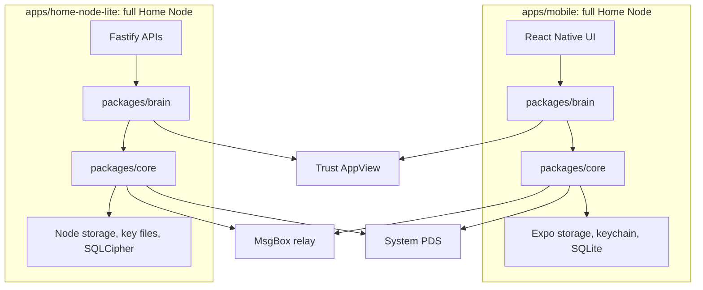

Mobile and server differ only in adapters:

- Mobile uses Expo adapters and in-process Core/Brain calls.
- Server Lite uses Node adapters and Fastify process boundaries.
- The protocol, vault rules, D2D envelope, trust records, and memory behavior
  should be the same.

## Install / Onboarding

During current install and onboarding, the node uses the test fleet by default.
The result is a local Home Node with keys, a local vault, a PDS account, a DID
document, and a MsgBox route.

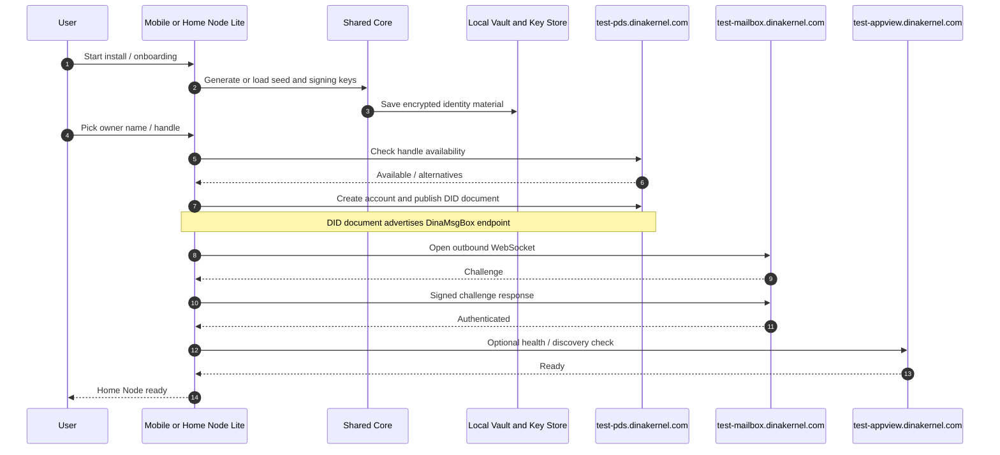

Production uses the release fleet only when release configuration is selected:
`mailbox.dinakernel.com`, `pds.dinakernel.com`, and `appview.dinakernel.com`.

## Boot / Reconnect

Boot is local first. Network services attach after the node can open its
identity and vault.

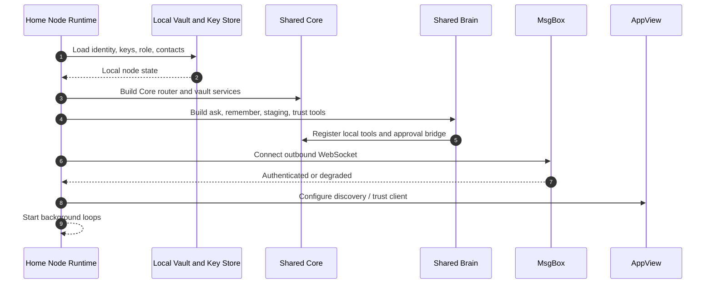

If MsgBox is offline, local memory still works. D2D and service queries degrade
until the relay reconnects.

## `/remember`: Store Local Memory

Main behavior is staging first. Core records provenance and session context,
Brain classifies and enriches, and Core stores only after persona gates pass.

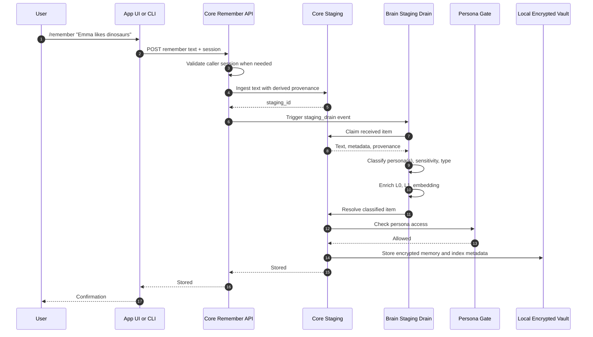

The main Core handler polls staging for a short window. If the item stores
quickly, `/remember` returns `stored`. If a persona approval is needed, it
returns an accepted/pending response instead of pretending the memory was stored.

## `/remember`: Sensitive Or Locked Persona

Sensitive memory follows the same staging path, but pauses at the persona gate.

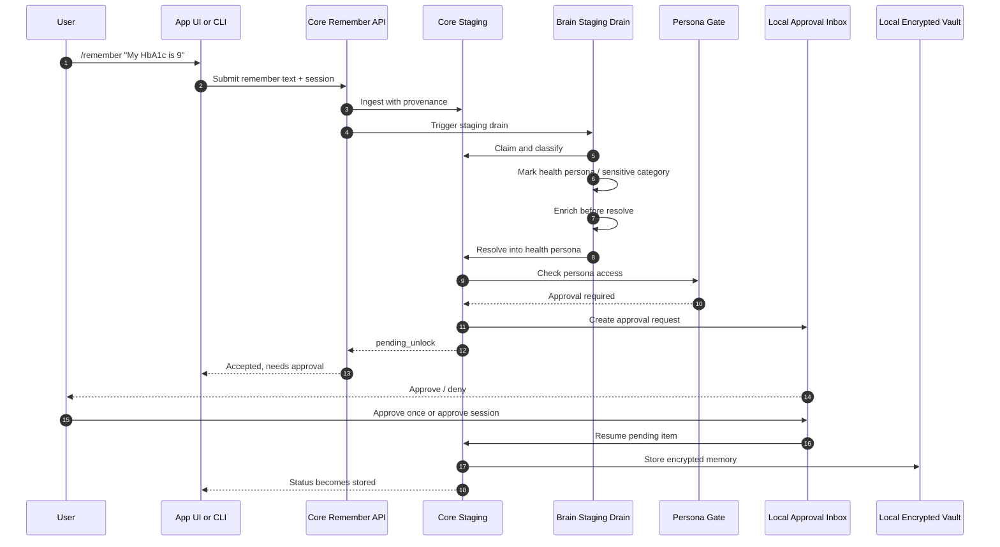

Multi-persona memories can fan out. Open personas store immediately; locked
personas get pending copies and approval records.

## `/ask`: Local Reasoning

Ask is local first. The node searches its own vault, assembles context, and only
uses network services when the question requires them.

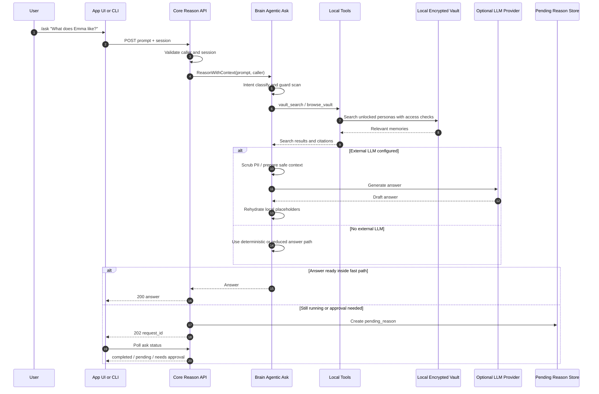

Main Core uses a short fast path before creating a pending reason. If Brain hits
a persona approval gate, the pending reason is tied to the approval request and
resumes after approval.

## `/ask`: Trust Context

When a question needs public trust data, the node combines local memory with
AppView results. Private memory stays local.

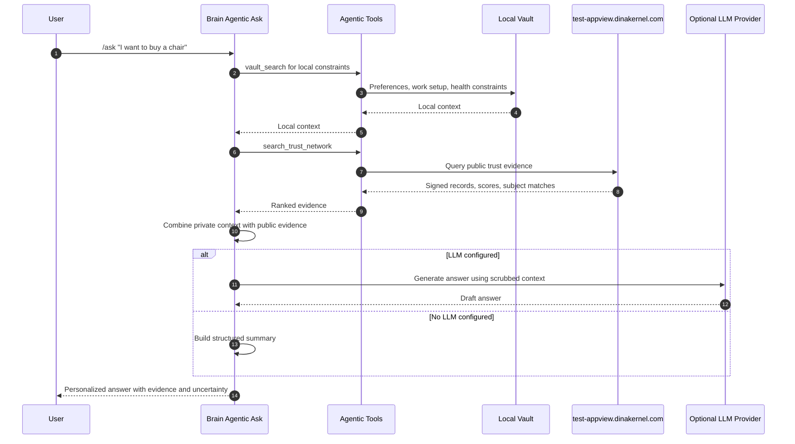

AppView is public trust search. PDS is public record storage. Neither should
receive raw private vault memory.

## D2D Message Through MsgBox

Every node uses outbound MsgBox transport. The sender does not need the
recipient to expose a public port.

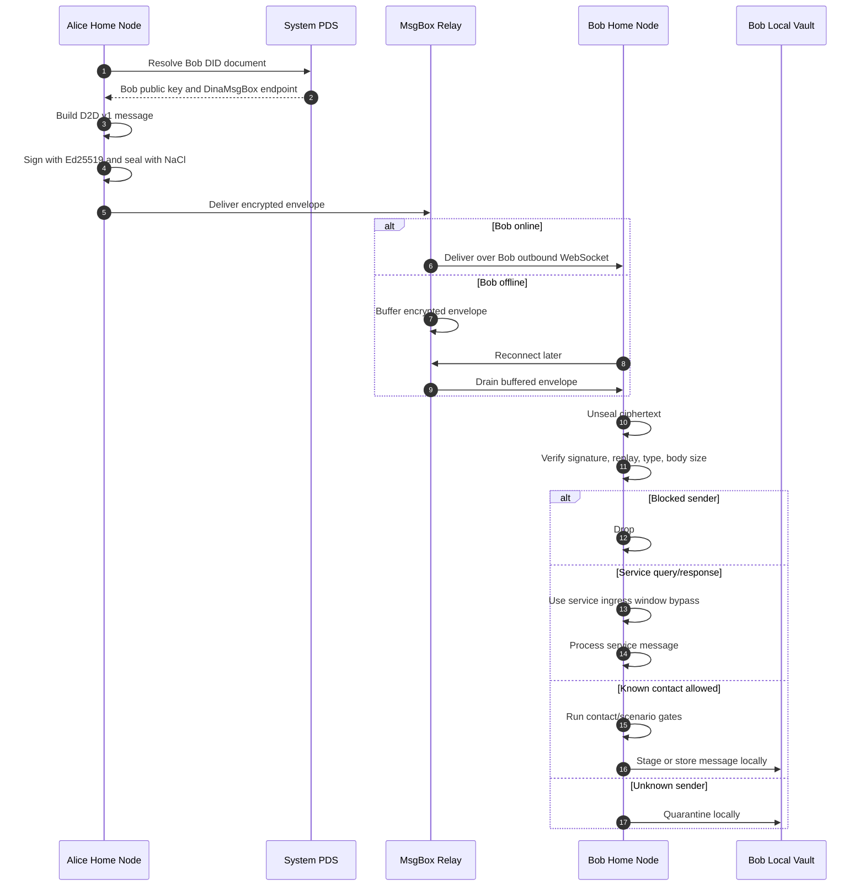

MsgBox sees routing metadata and ciphertext. It does not see the message body.

## Trust Network: Mobile Test Publish

Mobile is the best current reference for trust publish. In test builds, mobile
can publish directly to the test AppView injection endpoint when the test token
is bundled.

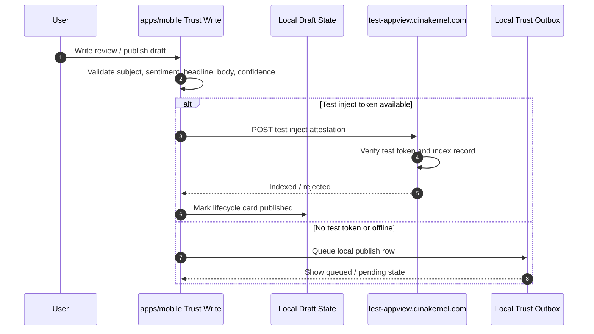

This test path is for development and preview. It bypasses PDS so mobile can
validate compose, review, and AppView indexing quickly.

## Trust Network: Release Publish

Release publish should use signed records through the user's PDS, then AppView
indexes from the public repo stream.

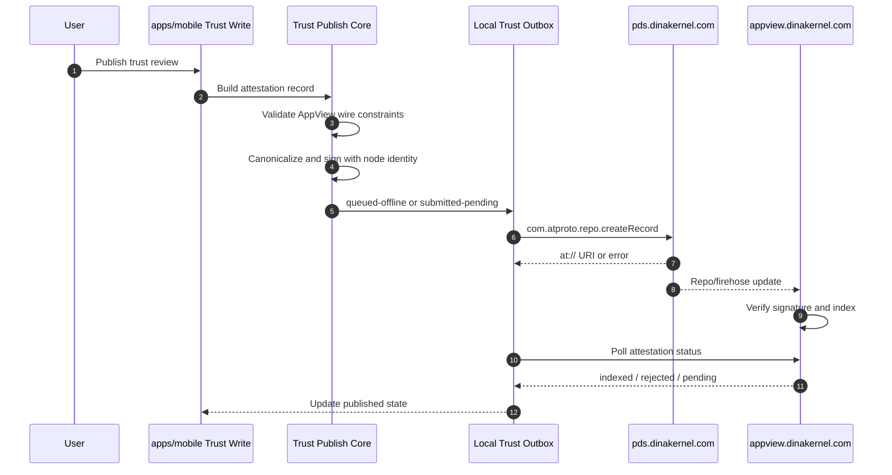

The current mobile outbox model already names the important states:
`queued-offline`, `submitted-pending`, `indexed`, `rejected`, `stuck-offline`,
and `stuck-pending`. Durable mobile persistence is the remaining implementation
detail to keep aligned with this flow.

## Trust Network: Query Review Evidence

AppView is the read path. PDS is the durable publication path.

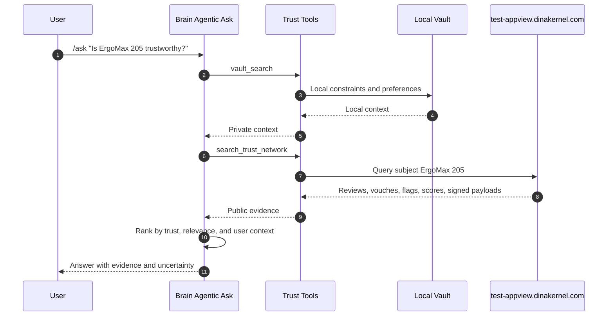

## Service Discovery And Query

Provider Dinas publish what they can answer. Requester Dinas discover providers
through AppView, then ask the provider through MsgBox.

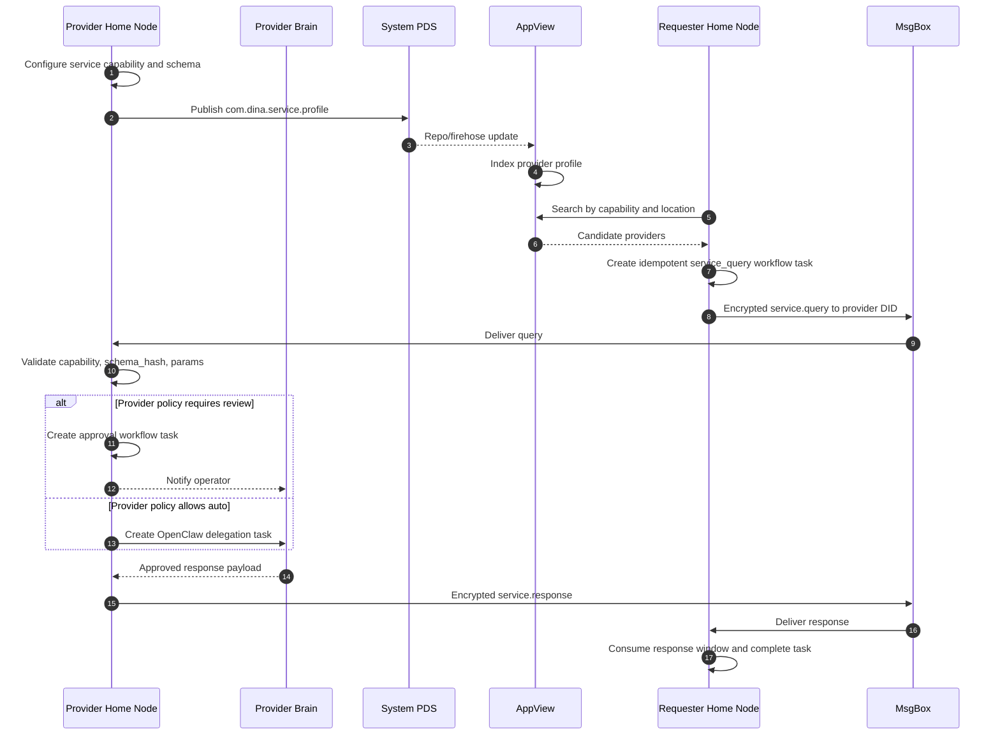

Service messages use D2D service windows so a query/response can pass without
turning the provider into a general open inbox.

## Pairing A Second Device

Pairing also goes through MsgBox. There is no direct LAN/public-port
requirement in the default path.

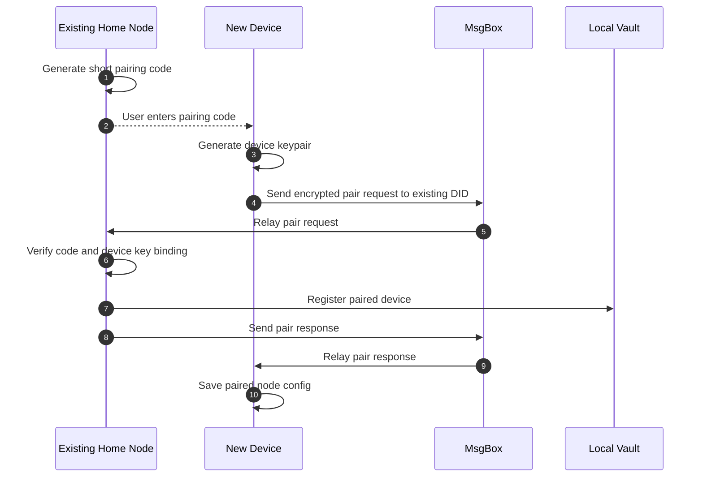

## What Stays Local

These should not go to PDS, AppView, or MsgBox as plaintext:

- Vault contents
- Persona data
- Health and finance memory
- User prompts and `/ask` text
- Local search results
- Approval decisions
- PII replacement maps
- Raw D2D message bodies

## What Goes To Shared Infrastructure

| Destination | Data |
|---|---|
| MsgBox | Encrypted D2D/RPC/service envelopes plus routing metadata |
| PDS | Public DID/account data and signed public trust/service records |
| AppView | Indexed public records derived from PDS firehose, plus test-only injected trust records |

The simplest rule: private life is local; public trust is signed and published;
transport is encrypted and relayed.

## Porting Checklist

Keep the TypeScript node aligned with the main behavior:

- Remember: preserve staging provenance, caller session, user-origin bypass,
  L0/L1/embedding enrichment before resolve, multi-persona fanout, and
  pending approval status.
- Ask: preserve fast response vs pending reason, persona approval resume,
  all-unlocked-persona vault search, trust-network tool use, service query tool
  use, PII scrub before cloud LLM calls, and final guard scan.
- D2D: preserve sign/seal, replay checks, type/body validation, blocked-sender
  drop, unknown-sender quarantine, and service bypass windows.
- Trust: use the mobile write/review/outbox behavior as the reference; test
  builds may inject into test AppView, release builds should publish signed
  records through PDS.
- Service: preserve workflow task idempotency, schema validation, review/auto
  policy, OpenClaw delegation, service.response completion, and D2D service
  windows.
